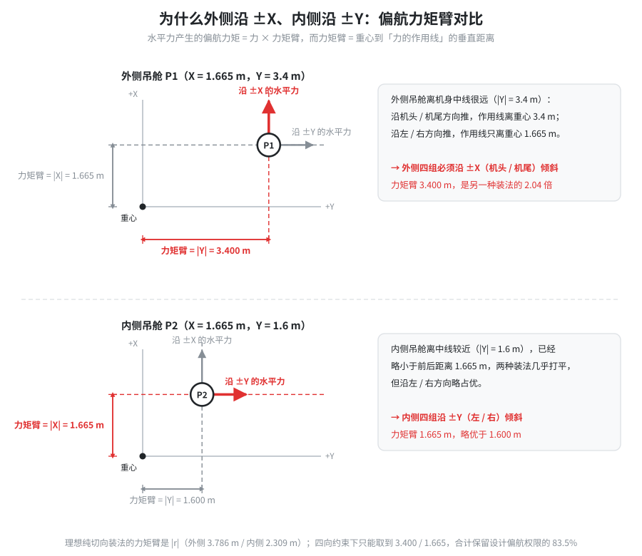
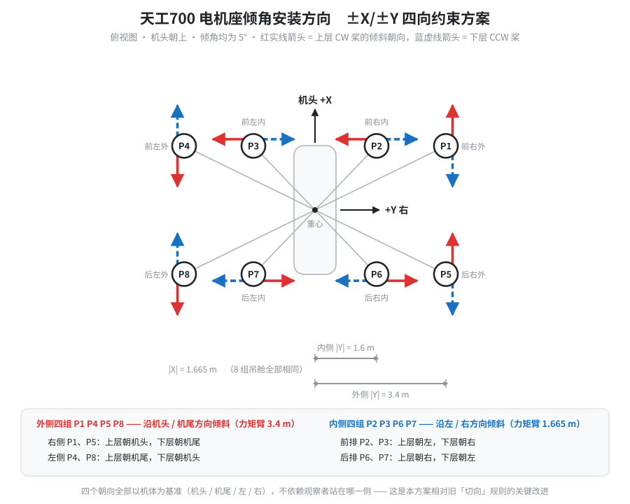
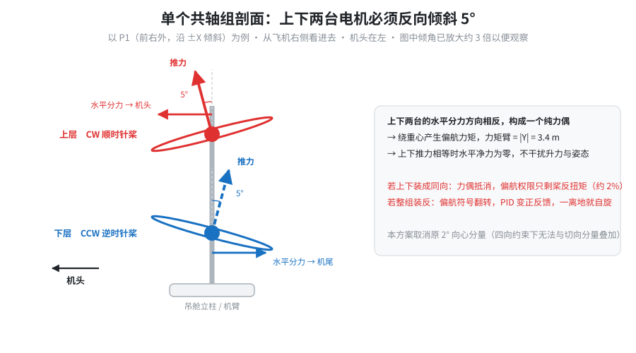

# 天工700（TG700）偏航控制定案 · ±X/±Y 四向倾角约束方案（v6.0）

| 项目 | 内容 |
|---|---|
| 机型 | TG700 / COAX16（16 电机 · 8 组共轴） |
| 全机重量 | 700 kg |
| 机上固件 | ArduPlane V4.7.0-dev (`3863214b`)，机架标识 `TG700/COAX16`（v4.0 混控） |
| 新固件标识 | `TG700/COAX16_AX4`（刷写成功后 GCS 与日志会显示此字符串） |
| 混控文件 | `libraries/AP_Motors/AP_MotorsMatrix_TG700.cpp`（本次改为 v6.0） |
| 分析依据 | `logs/2026-08-24 16-48-11.log`、`logs/2026-08-30 15-29-18.log`、`logs/2026-08-30 15-32-20.log`、`logs/2026-08-30 15-39-18.log` |
| 文档版本 | 2026-08-31 · 本文取代旧文档《TG700_电机倾角安装方向与偏航机理》第 2 / 6 章 |

---

## 摘要（先看这一页）

**新增的机械约束改变了方案。** 电机座结构上只能沿机体 X 轴或 Y 轴倾斜（即朝机头、机尾、左、右四个方向之一），做不到旧文档假设的"纯切向"。在这个约束下的最优装法是：

> **外侧 4 组（P1 P4 P5 P8）沿机头 / 机尾方向倾斜；内侧 4 组（P2 P3 P6 P7）沿左 / 右方向倾斜。**
> 这样能保留理想切向方案 **83.5%** 的偏航权限——损失很小，方案完全可用。

**三个日志给出的结论：**

| 日志 | 实际内容 | 结论 |
|---|---|---|
| `15-29-18` | 仅地面电机测试，85 s 内航向漂移 2.8° | 未离地，不能用于评估偏航 |
| `15-32-20` | **真实离地**（相对高度峰值 0.168 m），随即逆时针自旋 | **偏航符号装反了**：拟合得 偏航率 ≈ -1.59 × YOut - 0.70 |
| `15-39-18` | 地面怠速（油门 0.5~2%，电机 1070~1224 PWM） | 未离地；此时只改了 8 个座，权限仅剩设计值 **2%** |

**四条必须同时做的事（缺一不可）：**

1. **把剩下 8 个电机座（P1 P2 P7 P8）也改过来**，按第 3 章逐臂表执行。只改一半会让两半互相抵消，这正是 `15-39-18` 只剩 2% 权限的原因。
2. **回退代码里的 v5.0 棋盘式转向**（已在本次提交完成）。棋盘式方案偏航权限与现状完全相等，却要换 8 台电机的桨和 ESC 转向——收益为零、风险很高。
3. **修 `Q_M_THST_HOVER`（0.2 → 0.44）并提高 `Q_A_THR_MIX_MAN`（0.1 → 0.4）**。这两个参数直接决定混控给偏航的额度 `yaw_allowed`，能把它从 0.56 提到 0.69（+23%），是纯软件收益。
4. **把 `Q_A_RATE_Y_MAX` 从 100 °/s 降到 20 °/s**。修复后满舵实际约 19~20 °/s，设成 100 会让摇杆前 20% 就把控制器打饱和，飞手感觉"打了没反应"。

**预期结果：** 修复后满舵偏航率约 **19~20 °/s**（悬停油门 0.44），摇杆全行程线性可控。若仍嫌慢，唯一有效途径是加大倾角（10° 得 1.97 倍，15° 得 2.92 倍，代价是升力损失 1.5% / 3.4%）。

---

# 第 1 章　今天三个日志说明了什么

## 1.1 `15-29-18`：只有地面电机测试

- 全程无高度变化，电机输出停留在怠速区间
- 85 s 内航向角只漂移 2.8°，**不存在"一起飞就自转"**
- 反复出现两类 PreArm 告警：`DroneCAN: Duplicate Node ESC`、磁场强度不匹配

这个日志不能用于评估偏航，但两个 PreArm 告警需要单独处理（见第 5.6 节）。

## 1.2 `15-32-20`：确实离地了，而且偏航符号是反的

这是唯一一次真实离地的记录：相对起飞点高度峰值 **0.168 m**。

把 `RATE` 记录里的偏航控制器输出 `YOut` 与实际偏航率做线性拟合：

```
实际偏航率 ≈ -1.59 × YOut - 0.70      (单位 °/s)
```

两个信息都很关键：

**斜率是负的（-1.59）** —— 飞手打右舵（YOut 为正）时，飞机往左（逆时针）转。这不是权限不足，是**方向反了**。方向反了之后，ArduPilot 的航向保持环从负反馈变成正反馈：飞机偏左 → 控制器要求右舵 → 实际更往左偏 → 误差更大。这是一个指数发散过程，由拟合斜率算出的时间常数约 **2.06 s**。飞手察觉后继续加右舵，只是加速了发散。

**截距是 -0.70 °/s** —— 摇杆回中时仍有一个很小的逆时针常值偏置，量级上与"16 台电机的倾角残差不完全对消"相符，属次要问题。

## 1.3 `15-39-18`：地面怠速，而且只改一半更糟

飞手反馈"改了 8 个座好像好一点，但指令跟踪还是不紧"。这个日志的实际状态是：

- 油门 0.5~2%，电机输出 1070~1224 PWM（`Q_M_SPIN_ARM` 附近）
- 全程无高度变化，机身靠地面约束着

**所以"好一点"是地面摩擦带来的错觉，不是偏航改善。**

更重要的是，只改 8 个座造成了一种"对角半正确"状态：P3 P4 P5 P6 已按正确方向（上下镜像），P1 P2 P7 P8 仍是旧方向。这两半产生的偏航力矩**方向相反、量级相当**，绝大部分互相抵消，只剩下桨反扭矩这一项，即设计权限的约 **2%**。

这解释了飞手的两个矛盾感受：不再自旋（因为净符号不再是反的），但几乎没有权限（因为净幅值几乎归零）。

## 1.4 为什么"再改 8 个"不会变成顺时针失控

飞手担心把 P1 P2 P7 P8 也做同样操作后，会从逆时针失控变成顺时针失控。**不会。**

原因是这两半原本方向相反：

| 状态 | P3~P6 贡献 | P1/P2/P7/P8 贡献 | 合计 |
|---|---|---|---|
| 全部旧装法（`15-32-20`） | -50% | -50% | **-100%（反向，自旋）** |
| 只改一半（`15-39-18`） | +50% | -50% | **≈ 0（无权限）** |
| 全部改正（目标状态） | +50% | +50% | **+100%（正确）** |

把剩下 8 个改过来，是把 -50% 翻成 +50%，合计从 0 变成 +100%——方向正确、幅值满额。不存在"过冲到反向"的可能。

---

# 第 2 章　新约束下的方案推导

## 2.1 约束是什么

电机座只能沿以下四个方向之一倾斜（相对机体坐标系）：

- **朝机头**（+X）、**朝机尾**（-X）：倾斜轴平行于 X 轴
- **朝右**（+Y）、**朝左**（-Y）：倾斜轴平行于 Y 轴

做不到的：任意中间角度，尤其是旧方案要求的"垂直于中心-电机连线"的纯切向方向（外侧需偏 26.1°，内侧需偏 46.2°）。

## 2.2 偏航力矩臂只取决于与力垂直的那个坐标



位置 **r** = (r_x, r_y) 处的水平力 **F** 产生的偏航力矩：

```
M_z = r_x · F_y - r_y · F_x
```

代入四个允许方向，力矩臂（即重心到力的作用线的垂直距离）为：

| 倾斜方向 | 水平力 | 偏航力矩臂 |
|---|---|---|
| 朝机头 / 机尾 | 沿 ±X | **\|r_y\|** |
| 朝右 / 朝左 | 沿 ±Y | **\|r_x\|** |

TG700 的几何是 `|r_x| = 1.665 m`（8 组吊舱全部相同），`|r_y|` = 3.4 m（外侧）或 1.6 m（内侧）。于是：

- **外侧**：`|r_y| = 3.400 > |r_x| = 1.665` → 沿 **±X** 倾斜，力矩臂 3.400 m（是另一种装法的 2.04 倍）
- **内侧**：`|r_y| = 1.600 < |r_x| = 1.665` → 沿 **±Y** 倾斜，力矩臂 1.665 m（略优）

## 2.3 一个更好记的等价判据

把旧文档第 2.3 节的**正确**切向方向（那张表是对的）就近取整到最近的允许轴，结果与上面的推导**完全一致**：

| 臂位 | 正确切向单位向量（上层 CW） | 主分量 | 取整后 |
|:---:|---|:---:|:---:|
| P1 前右外 | (+0.898, -0.440) | +X | 机头 |
| P2 前右内 | (+0.693, -0.721) | -Y | 左 |
| P3 前左内 | (-0.693, -0.721) | -Y | 左 |
| P4 前左外 | (-0.898, -0.440) | -X | 机尾 |
| P5 后右外 | (+0.898, +0.440) | +X | 机头 |
| P6 后右内 | (+0.693, +0.721) | +Y | 右 |
| P7 后左内 | (-0.693, +0.721) | +Y | 右 |
| P8 后左外 | (-0.898, +0.440) | -X | 机尾 |

主分量的绝对值就是该臂的效率：外侧 0.898（89.8%），内侧 0.721（72.1%）。

## 2.4 权限对比

倾角均取 5°，以"等差动分配"（16 台电机差动量相同）计算总偏航力矩 Σ|c|：

| 方案 | Σ\|c\| | 占理想切向 | 说明 |
|---|:---:|:---:|---|
| 理想纯切向 | 4.3393 | 100.0% | **机械上做不到** |
| **外侧 ±X + 内侧 ±Y** | **3.6212** | **83.5%** | **本方案** |
| 全部 ±X | 3.5758 | 82.4% | 次优，但所有座朝向统一，更易施工 |
| 全部 ±Y | 2.4114 | 55.6% | 不推荐，浪费外侧的长力臂 |

按"最优比例分配"衡量结论一致（本方案 81.4%）。**本方案与"全部 ±X"只差 1.1 个百分点**——如果现场发现内侧座沿 ±Y 装配困难，退用"全部 ±X"是完全可接受的备选。

## 2.5 寄生耦合校核：干净

用脚本对 16 台电机求和验证（`docs/analysis/tg700_tilt_axis_constrained.py`）：

```
净水平力    Fx = 0.000e+00     Fy = 0.000e+00      （应为 0）
寄生滚转力矩 Mx = -1.39e-17                        （应为 0）
寄生俯仰力矩 My = 0.000e+00                        （应为 0）
```

原因是上层 4 个 ±X 力两两反向对消、4 个 ±Y 力两两反向对消，下层同理。**打偏航舵不会产生侧移、掉高或滚转俯仰扰动。**

---

# 第 3 章　逐臂安装表（现场施工用）

## 3.1 总览图



## 3.2 逐臂精确方向表

坐标定义（ArduPilot NED 体轴系）：**+X 机头，+Y 右侧，+Z 向下**；正偏航为俯视顺时针。
转向沿用现状，**不需要换桨、不需要改 ESC 转向**：每组上层 CW（顺时针桨），下层 CCW（逆时针桨）。

| 臂位 | 位置 | 坐标 (X, Y) m | 倾斜轴 | 力矩臂 | **上层 CW 顶部朝向** | **下层 CCW 顶部朝向** |
|:---:|---|:---:|:---:|:---:|:---:|:---:|
| **P1** | 前右外 | (+1.665, +3.4) | ±X | 3.400 m | **机头** | **机尾** |
| **P2** | 前右内 | (+1.665, +1.6) | ±Y | 1.665 m | **左** | **右** |
| **P3** | 前左内 | (+1.665, -1.6) | ±Y | 1.665 m | **左** | **右** |
| **P4** | 前左外 | (+1.665, -3.4) | ±X | 3.400 m | **机尾** | **机头** |
| **P5** | 后右外 | (-1.665, +3.4) | ±X | 3.400 m | **机头** | **机尾** |
| **P6** | 后右内 | (-1.665, +1.6) | ±Y | 1.665 m | **右** | **左** |
| **P7** | 后左内 | (-1.665, -1.6) | ±Y | 1.665 m | **右** | **左** |
| **P8** | 后左外 | (-1.665, -3.4) | ±X | 3.400 m | **机尾** | **机头** |

全部 16 台倾角均为 **5° ± 0.5°**。

## 3.3 两条口诀

> **外侧四组（P1 P4 P5 P8）—— 沿机头 / 机尾方向倾斜**
> 　右侧 P1、P5：上层朝机头，下层朝机尾
> 　左侧 P4、P8：上层朝机尾，下层朝机头
>
> **内侧四组（P2 P3 P6 P7）—— 沿左 / 右方向倾斜**
> 　前排 P2、P3：上层朝左，下层朝右
> 　后排 P6、P7：上层朝右，下层朝左

**这四个朝向全部以机体为基准（机头 / 机尾 / 左 / 右），不依赖观察者站在哪一侧。** 这是本方案相对旧文档"站在臂端面朝中心，向左手边倾斜"那条规则的关键改进——旧规则依赖站位，正是这次现场装反的直接原因（见第 7 章勘误）。

## 3.4 共轴组内部：上下必须反向



同一组的上下两台电机，水平分力方向相反，构成一个**纯力偶**：

- 绕重心产生偏航力矩，力矩臂即上表数值
- 上下推力相等时水平净力为零，不干扰升力与姿态
- 偏航指令通过"上层减推力、下层加推力"（或反之）破坏这个平衡，从而产生净偏航力矩

两种典型错装的后果：

| 错装形态 | 后果 |
|---|---|
| 同一组上下**同向**倾斜 | 力偶抵消，偏航权限只剩桨反扭矩（约 2%） |
| 整组（或全机）**方向装反** | 偏航符号翻转，PID 变正反馈，一离地就自旋 |
| 只改一半（对角半正确） | 两半互相抵消，权限约 2%（即 `15-39-18` 的状态） |

## 3.5 取消原来的 2° 向心分量

旧方案是 5° 切向 + 2° 向心叠加，合成 5.385°。四向约束下向心方向（沿半径指向机身）通常既不平行 X 轴也不平行 Y 轴，**无法与主倾角叠加**，因此本方案取消 2° 向心分量，只保留单一 5°。

代价很小：向心分量原本只用于"改善横滚线性度、降低桨间干扰"，不产生任何偏航力矩。取消后油门因子由 `cos(5°)·cos(2°) = 0.9956` 变为 `cos(5°) = 0.9962`，升力反而略有增加。

## 3.6 施工核查清单

对 P1 到 P8 逐一执行，**不需要拆机**：

**第 1 步　确认机头方向**，在地面用胶带标出机体 X 轴与 Y 轴，避免凭感觉判断。

**第 2 步　查倾斜轴**：外侧 4 组（P1 P4 P5 P8）的倾斜方向应**平行于机身纵轴**（前后）；内侧 4 组（P2 P3 P6 P7）应**平行于机翼横轴**（左右）。若某组的轴向不对，把电机座整体旋转 90°。

**第 3 步　查上下朝向**：按 3.2 表逐台核对上层与下层的顶部朝向。若某组上下**同向**，把其中一台的座旋转 180°。

**第 4 步　测角度**：手机水准仪贴电机外壳侧面，读数应为 **5° ± 0.5°**。注意本方案只有单一倾角，不再有 5.4° 的合成角。

**第 5 步　拍照留档**：每台电机拍一张能看出倾斜方向的侧视照，标注臂位与层位，便于事后复核。

---

# 第 4 章　混控代码修改

## 4.1 先回退 v5.0 棋盘式转向（重要）

仓库里的 `AP_MotorsMatrix_TG700.cpp` 之前被改成了 v5.0 棋盘式（`_frame_type_string = "COAX16_CB"`：同组共轴同向、相邻组反向）。**这份代码从未刷进飞控**（三个日志都显示 `TG700/COAX16`，即 v4.0），而且飞机上那 8 台需要换向的电机的桨与 ESC 转向也没有改。

**如果按当前硬件刷入 v5.0，会有 8 台电机的偏航方向与混控假设相反**，不仅偏航失效，还会引入 roll / pitch / 油门耦合，比不改更危险。

同时，v5.0 在偏航权限上**没有任何收益**。解析上可以证明：偏航权限等于参与差动的各电机 `|dM/dT| = sin(倾角)·力矩臂 + Q/T` 之和，只取决于电机位置，与转向无关；两种方案都是 8 台对 8 台、且各含 4 个外侧 + 4 个内侧，因此逐项相等。

**本次提交已把转向恢复为 v4.0（每组上层 CW / 下层 CCW），并把版本标识改为 `COAX16_AX4`。**

## 4.2 新的 yaw 因子

```cpp
// ---------- 物理安装角度 ----------
// v6.0: 单一倾角, 方向沿机体 ±X 或 ±Y (四向约束), 不再有向心分量
#define TG700_TILT_DEG              5.0f
#define TG700_SIN_TILT              0.08716f   // sin(5°)
#define TG700_COS_TILT              0.99619f   // cos(5°)
#define TG700_THROTTLE_FACTOR       0.9962f    // cos(5°)

// ---------- Yaw因子 ----------
// 幅值 = [sin(倾角) × 力矩臂 + Q/T] / Y_max,  Q/T ≈ 0.0056 m
//   外侧 (沿 ±X, 力矩臂 = |Y| = 3.400 m): (0.08716×3.400 + 0.0056)/3.4 = 0.0888
//   内侧 (沿 ±Y, 力矩臂 = |X| = 1.665 m): (0.08716×1.665 + 0.0056)/3.4 = 0.0443
#define TG700_YAW_OUTER_CW         (-0.0888f)
#define TG700_YAW_OUTER_CCW        ( 0.0888f)
#define TG700_YAW_INNER_CW         (-0.0443f)
#define TG700_YAW_INNER_CCW        ( 0.0443f)
```

与旧值的对比：

| | 旧值（纯切向） | 新值（四向约束） | 变化 |
|---|:---:|:---:|:---:|
| 外侧 | 0.0971 | 0.0888 | -8.5% |
| 内侧 | 0.0592 | 0.0443 | -25.2% |
| 内 / 外比 | 0.610 | 0.499 | 内侧权重下调 |

## 4.3 关于归一化的一个提醒

`AP_MotorsMatrix::normalise_rpy_factors()` 会把 yaw 因子整体缩放到 `max|yaw_fac| = 0.5`，因此**只有"内侧:外侧"的比值会影响最终混控，绝对幅值不会**。

这也意味着：**单纯修改代码里的倾角常数，不会改变飞机的实际偏航权限**。真实权限由电机座的物理倾角决定，代码里的数值只负责把 16 台电机之间的相对配比算对。想提升权限必须动机械。

归一化还有一个副作用：它把"偏航天生比横滚弱 11.3 倍"这个事实**对 PID 隐藏了**——PID 看到的 roll 和 yaw 因子最大值都是 0.5，于是同样的增益在偏航轴上会迅速饱和。这是偏航 PID 反复调不动的深层原因。

## 4.4 自动校核

运行 `docs/analysis/tg700_verify_v6_mixer.py`，它会解析 cpp 源码并独立校核转向交替、因子与几何一致性、以及解耦性：

```
frame_type_string = COAX16_AX4
2) 转向交替: 通过 (每组上层 yaw<0 = CW, 下层 yaw>0 = CCW)
   Σ yaw×roll  = +0.000e+00  OK
   Σ yaw×pitch = +0.000e+00  OK
   Σ yaw×thr   = +0.000e+00  OK
   反推力矩臂:  外侧 3.400 m,  内侧 1.664 m     （与设计一致）
总校核结果: 全部通过
```

---

# 第 5 章　参数调整清单

## 5.1 混控给偏航的额度 `yaw_allowed`：一个被忽视的软件瓶颈

`AP_MotorsMatrix::output_armed_stabilizing()` 会计算一个偏航额度，把偏航指令硬性截断：

```cpp
throttle_thrust_best_rpy = MIN(0.5f, throttle_avg_max);
motor_room               = throttle_thrust_best_rpy;        // 需要减推力的那台
motor_yaw_allowed        = motor_room / fabsf(_yaw_factor[i]);
yaw_allowed              = MIN(所有电机的 motor_yaw_allowed);
yaw_allowed              = MAX(yaw_allowed, _yaw_headroom * 0.001f);
if (fabsf(yaw_thrust) > yaw_allowed) { yaw_thrust = 截断; limit.yaw = true; }
```

因为归一化后外侧电机的 `|yaw_factor| = 0.5`，这一串化简成一个很简洁的式子：

```
yaw_allowed = 2 × MIN(0.5, throttle_avg_max)
```

而 `throttle_avg_max` 来自 `AC_AttitudeControl_Multi::get_throttle_avg_max()`：

```
throttle_avg_max = MAX( 油门, 油门×(1 - THR_MIX) + THST_HOVER×THR_MIX )
```

代入当前参数（`Q_M_THST_HOVER = 0.2`、`Q_A_THR_MIX_MAN = 0.1`、离地油门 ≈ 0.28）：

| 配置 | throttle_avg_max | **yaw_allowed** | 相对当前 |
|---|:---:|:---:|:---:|
| **当前**（hover 0.2，mix 0.1） | 0.280 | **0.560** | 1.00× |
| hover 0.44，mix 0.1 | 0.296 | 0.592 | 1.06× |
| **hover 0.44，mix 0.4（建议）** | 0.344 | **0.688** | **1.23×** |
| 真悬停油门 0.44 时 | 0.440 | 0.880 | 1.57× |
| 理论上限（best_rpy 封顶 0.5） | 0.500 | 1.000 | 1.79× |

**结论：改这两个参数能白拿 23% 偏航权限，不需要动任何硬件。** 这是今天分析中新发现的一条。

顺带回答之前关于 `Q_M_YAW_HEADROOM` 的疑问：该参数当前已是 **500，也就是参数允许的最大值**（范围 0~500），它提供的下限是 `500 × 0.001 = 0.5`，而实际算出的 `yaw_allowed = 0.56` 已经高于它。**所以它现在不是瓶颈，200 → 300 → 500 的调整对当前状态没有影响。** 它只在油门低于 0.25 时才会起作用（那时 `2 × 油门 < 0.5`）。

## 5.2 `Q_M_THST_HOVER` 怎么标定

当前值 **0.2** 明显失真（日志后段还出现过 NaN）。它有三个作用，全都被这个错值拖累：

1. 高度控制器的前馈基准（自动模式下会掉高）
2. 飞手油门摇杆曲线的中位点（`get_pilot_throttle()` 用它做指数曲线的拐点）
3. **通过 `throttle_avg_max` 决定姿态混控的余量**，见 5.1

**标定方法（两种，任选）：**

- **方法 A（推荐，直接读数）**：系留状态进 QSTABILIZE，缓慢加油门到飞机刚好稳定悬停（起落架刚离地、无明显升降），保持 10 s，从日志 `CTUN.ThO` 或 `RCOU` 读取此时的平均油门。`15-32-20` 的离地油门为 0.25~0.28，考虑到当时载荷偏轻且未完全脱离地效，**取 0.44 作为满载估计值**。
- **方法 B（自动学习）**：`Q_M_HOVER_LEARN = 2` 只在满足全部条件时才更新——已解锁、VTOL 飞行中、无明显升降、空速低、且 **Z 轴控制器激活**。QSTABILIZE 不满足最后一条，所以之前一直没学到。要用自动学习必须进 QHOVER 或 QLOITER。

**标定期间请先设 `Q_M_HOVER_LEARN = 0`**，避免在错误条件下把 0.2 固化下来；确认数值合理后再改回 2。

## 5.3 速率与加速度上限：让摇杆重新变线性

`Q_A_RATE_Y_MAX = 100 °/s` 而修复后物理可达约 **19~20 °/s**。后果是摇杆推到 20% 时目标速率就已经超出飞机能力，剩下 80% 行程完全无效——飞手描述的"打满舵没反应"很大一部分来自这里，而不是纯粹的权限不足。

`Q_A_ACCEL_Y_MAX = 68000 cdeg/s^2 = 680 °/s^2`，而物理角加速度上限约 **28 °/s^2**（700 kg 机体的偏航转动惯量所限）。目标速率斜坡比飞机快 24 倍，只会制造巨大的瞬态跟踪误差、把 PID 打进饱和并造成积分堆积。

## 5.4 完整参数表

**阶段一：刷固件前后立即设置（地面）**

| 参数 | 当前 | 建议 | 依据 |
|---|:---:|:---:|---|
| `Q_M_THST_HOVER` | 0.2 | **0.44** | 见 5.2；同时抬升 `yaw_allowed` |
| `Q_M_HOVER_LEARN` | 2 | **0** | 标定确认后再改回 2 |
| `Q_A_THR_MIX_MAN` | 0.1 | **0.40** | `yaw_allowed` 0.56 → 0.69（+23%） |
| `Q_A_RATE_Y_MAX` | 100 | **20** | 匹配物理可达速率，恢复摇杆线性 |
| `Q_A_ACCEL_Y_MAX` | 68000 | **6000** | 约 2 倍物理上限（60 °/s^2 vs 28 °/s^2） |
| `Q_A_SLEW_YAW` | 2500 | **2000** | 与速率上限对齐 |
| `Q_M_YAW_HEADROOM` | 500 | 500（不变） | 已是参数上限，且非当前瓶颈 |
| `INS_USE2` | 0 | **1** | 恢复三 IMU（当前实际只用了 IMU1） |
| `EK3_IMU_MASK` | 1 | **7** | 恢复三 IMU 融合 |

**阶段二：系留悬停确认符号正确后再调 PID**

| 参数 | 当前 | 建议 | 依据 |
|---|:---:|:---:|---|
| `Q_A_RAT_YAW_P` | 2.5 | **1.5** | 当前是默认值 0.18 的 13.9 倍，且 75% 时间饱和；速率上限修正后不再需要这么高 |
| `Q_A_RAT_YAW_I` | 0.3 | **0.12** | 降低饱和后的积分堆积 |
| `Q_A_RAT_YAW_IMAX` | 0.65 | **0.35** | 限制 windup |
| `Q_A_RAT_YAW_FF` | 0.1 | **0.20** | 权限受限的系统靠前馈比靠反馈更线性 |
| `Q_A_RAT_YAW_D` | 0.02 | 0.02（不变） | 保持 |

> PID 必须**先确认符号正确、再调增益**。在符号反的状态下调 PID，增益越大发散越快。

**待实测确认，暂不改动**

| 参数 | 当前 | 说明 |
|---|:---:|---|
| `Q_M_THST_EXPO` | 0.8 | 偏高，会让中低油门段推力曲线过于非线性。需要电机-桨台架推力曲线实测后再定，不建议凭感觉改。 |
| `Q_THROTTLE_EXPO` | 0.2 | 与 `Q_M_THST_HOVER` 联动影响摇杆手感，等 THST_HOVER 标定后再评估。 |

## 5.5 为什么"继续加偏航增益"已经没有意义

来自 `logs/2026-08-24 16-48-11.log` 的证据：

- 偏航输出 **74.9%** 的时间处于饱和（超出 ±1），**53%** 的时间超过 2 倍上限
- 积分项被抗饱和逻辑冻结
- `Q_A_RAT_YAW_P = 2.5` 已经是俯仰 `Q_A_RAT_PIT_P = 0.23` 的 **10.9 倍**，是默认值的 13.9 倍
- `Q_A_RAT_YAW_I = 0.3` 是默认值的 16.7 倍

一个已经饱和 75% 时间的控制器，再加增益只会延长饱和时间、加剧积分堆积和极限环振荡。**出路只有三条：修机械（第 3 章）、抬 `yaw_allowed`（5.1）、把目标速率降到可达范围（5.3）。**

## 5.6 两个反复出现的 PreArm 告警

**`DroneCAN: Duplicate Node ESC...`** —— ArduPilot DNA Server 的已知设计限制：节点分配数据库是全局的，跨 CAN 总线的 Node ID 重叠或数据库残留都会触发。处理：清空 DNA 数据库 → 连续重启两次 → 确认 CAN1 与 CAN2 的 Node ID 全局唯一（不只是各自总线内唯一）。

**磁场强度不匹配** —— 铁鸟台的钢结构会严重扰动地磁。系留台架测试期间可以接受，但转入外场飞行前必须重做罗盘校准，并在远离钢结构的位置复核。

---

# 第 6 章　地面验证流程（不飞就能确认符号）

改完电机座、刷完固件后，**必须先在地面确认偏航符号，再考虑离地**。

## 6.1 第一步：确认固件与混控已生效

上电后在 GCS 消息栏确认三行：

```
ArduPlane V4.7.0-dev (<新的 commit 短号>)
QuadPlane Frame: TG700/COAX16_AX4        <-- 关键，必须是 COAX16_AX4
Param space used: ...
```

若仍显示 `TG700/COAX16`，说明固件没刷进去，**停止后续步骤**。

## 6.2 第二步：静态转向与倾角复核

不解锁，逐台核对：

- 16 台电机的桨型与转向标记：每组上层 CW、下层 CCW（本次不改）
- 16 个电机座的倾斜轴与朝向：对照第 3.2 表和第 3.6 清单

## 6.3 第三步：系留满舵测试（关键一步）

系留牢固，进 QSTABILIZE，油门加到刚好有明显推力但不离地，然后：

| 操作 | 正确表现 | 异常表现与判断 |
|---|---|---|
| 打**右**舵（顺时针） | 机体有明显**顺时针**扭转趋势；`RCOU` 上层电机降、下层电机升 | 若扭转趋势为**逆时针** → **符号仍反**，立即停止，回查第 3.2 表 |
| 打**左**舵 | 机体有明显**逆时针**扭转趋势 | 同上取反 |
| 摇杆回中 | 无持续单向扭转趋势 | 若持续单向 → 仍有对消残差，复查是否有个别座装反 |
| 打右舵时看高度/滚转 | 基本不变 | 若明显掉高或滚转 → 有座装成了错误轴向 |

**判断依据必须是"机体是否真的产生偏航趋势"，不能看 `RCOU` 差值。** 因为 PID 饱和时差动一定是开到最大的，装错和装对的电机输出看起来一样。

## 6.4 第四步：记录标定数据

系留状态下打满舵，记录日志，事后从 `RATE` 记录提取：

- `YOut` 与实际偏航率的**符号关系**（必须为正相关）
- 满舵时的实际偏航率峰值 → 用它回填 `Q_A_RATE_Y_MAX`
- 阶跃响应上升时间 → 用它回填 `Q_A_ACCEL_Y_MAX`

## 6.5 第五步：松系留、离地悬停

只有前四步全部通过后才做。首飞保持低高度、短时间，重点复核偏航符号与摇杆线性度。

---

# 第 7 章　旧文档勘误（这次装反的直接原因）

旧文档《TG700_电机倾角安装方向与偏航机理》第 2.2 节的"万能规则"与第 6.1 / 6.2 节的现场清单，**左右方向与该文档自身的公式、逐臂表、示意图相反**。现场按错误的那一版施工，直接导致了 `15-32-20` 的偏航符号反转与逆时针自旋。

## 7.1 错在哪里

| 位置 | 原文（**错**） | 正确表述 |
|---|---|---|
| 2.2 万能规则 | 站在臂端面朝中心，上层 CW 向**左手边**倾斜，下层 CCW 向**右手边** | 上层 CW 向**右手边**，下层 CCW 向**左手边** |
| 6.1 第 2 / 3 步 | 上层顶部向**左手边**，下层向**右手边** | 上层**右手边**，下层**左手边** |
| 6.2 判定表 | "上层倾左、下层倾右（向内看）"= 正确 | 这一行才是**错法**；"上层倾右、下层倾左"（原文标为"错法 3"）才是**正确** |

**该文档的第 2.3 节逐臂表、第 4 章公式推导、以及三张 SVG 示意图都是正确的**，与本文第 2.3 节的取整验证完全吻合。错误只出现在那几段"便于记忆"的文字规则里。

验证方法（以 P1 前右外为例）：站在 P1 面朝中心时朝向 **f** = -**r**/|**r**| = (-0.440, -0.898)，左手方向 = (f_y, -f_x) = (-0.898, +0.440)，指向机尾偏右。而 2.3 表要求上层 CW 朝"机头，偏左 26.1°" = (+0.898, -0.440)，恰好是**右手**方向。

## 7.2 处理方式

- 旧文档第 2 章、第 6 章由**本文第 3 章**取代，以本文为准
- 旧文档第 1 章（机理科普）、第 4 章（计算推导）、第 5 章（日志证据链）仍然有效
- **本文所有方向都改用机体基准（机头 / 机尾 / 左 / 右）**，彻底移除"站位 + 左右手"这种依赖观察者的表述

---

# 第 8 章　长期改进：加大倾角

本方案在 5° 倾角下的可达偏航率约 19~20 °/s。对 700 kg、翼展 11 m 的机体，这个数值可用但不宽裕。**唯一能实质提升偏航权限的途径是加大倾角**（改代码常数无效，见 4.3）。

| 倾角 | 偏航权限 Σ\|c\| | 相对 5° | 升力损失 cos θ | 700 kg 折算 | 预估满舵偏航率 |
|:---:|:---:|:---:|:---:|:---:|:---:|
| **5°** | 3.6212 | 1.00× | 0.38% | 2.7 kg | ~20 °/s |
| 8° | 5.7289 | 1.58× | 0.97% | 6.8 kg | ~31 °/s |
| **10°** | 7.1258 | **1.97×** | 1.52% | 10.6 kg | ~39 °/s |
| 12° | 8.5142 | 2.35× | 2.19% | 15.3 kg | ~47 °/s |
| **15°** | 10.5769 | **2.92×** | 3.41% | 23.9 kg | ~58 °/s |
| 18° | 12.6110 | 3.48× | 4.89% | 34.3 kg | ~70 °/s |
| 20° | 13.9483 | 3.85× | 6.03% | 42.2 kg | ~77 °/s |

**建议：先把 5° 方案装正确并飞出可信数据，再决定是否加大。** 如果确定要改，10°~12° 是性价比最高的区间——接近 2 倍权限，升力损失控制在 2% 以内（15 kg 以下）。

改倾角时同步要做的事：

1. 更新 `TG700_TILT_DEG` 与 `TG700_SIN_TILT` / `TG700_COS_TILT`
2. 按新倾角重算 yaw 因子与 `TG700_THROTTLE_FACTOR`（= cos θ）
3. 重新标定 `Q_M_THST_HOVER`（升力损失会抬高悬停油门）
4. 重新设定 `Q_A_RATE_Y_MAX` 与 `Q_A_ACCEL_Y_MAX`

---

## 附录 A　分析与校核脚本

| 脚本 | 作用 |
|---|---|
| `docs/analysis/tg700_tilt_axis_constrained.py` | 四向约束下的方案推导、权限对比、耦合校核、新 yaw 因子、倾角权衡表 |
| `docs/analysis/tg700_verify_v6_mixer.py` | 解析 cpp 源码，独立校核转向交替 / 因子几何一致性 / 解耦性 |
| `docs/analysis/gen_tilt_svg.py` | 生成本文三张示意图 |
| `docs/analysis/render_svg_png.py` | 用无头 Edge 把 SVG 渲染为 PNG 以便目视检查 |
| `docs/analysis/tg700_yaw_scheme_compare.py` | 证明 v5.0 棋盘式转向与 v4.0 偏航权限完全相等 |

## 附录 B　配图清单

| 图 | 文件 | 内容 |
|---|---|---|
| 图 1 | `images/TG700_倾角安装_新方案俯视图.svg` | 16 台电机的倾斜朝向总览 + 两条口诀 |
| 图 2 | `images/TG700_倾角安装_力矩臂对比.svg` | 为什么外侧沿 ±X、内侧沿 ±Y |
| 图 3 | `images/TG700_倾角安装_共轴组剖面.svg` | 单个共轴组的上下反向倾斜与力偶 |

## 附录 C　行动清单（可直接打印）

- [ ] **机械**：P1 P2 P7 P8 共 8 个电机座按第 3.2 表改向（P3~P6 已完成，仍需按表复核）
- [ ] **机械**：16 台全部复核倾斜轴（外侧前后 / 内侧左右）与角度 5°±0.5°，逐台拍照
- [ ] **代码**：确认 `AP_MotorsMatrix_TG700.cpp` 为 v6.0、`COAX16_AX4`（已完成）
- [ ] **代码**：运行 `tg700_verify_v6_mixer.py` 确认"全部通过"（已完成）
- [ ] **编译**：重新编译 ZeroOneM9 固件并刷写
- [ ] **参数**：按 5.4 阶段一设置 9 个参数
- [ ] **验证**：GCS 确认显示 `TG700/COAX16_AX4`
- [ ] **验证**：系留满舵测试，确认右舵 → 顺时针（第 6.3 节）
- [ ] **验证**：从日志回填 `Q_A_RATE_Y_MAX` 与 `Q_A_ACCEL_Y_MAX`
- [ ] **参数**：按 5.4 阶段二调偏航 PID
- [ ] **遗留**：处理 DroneCAN Duplicate Node 与罗盘校准（5.6）
- [ ] **决策**：根据实飞数据决定是否把倾角加大到 10°~12°（第 8 章）
