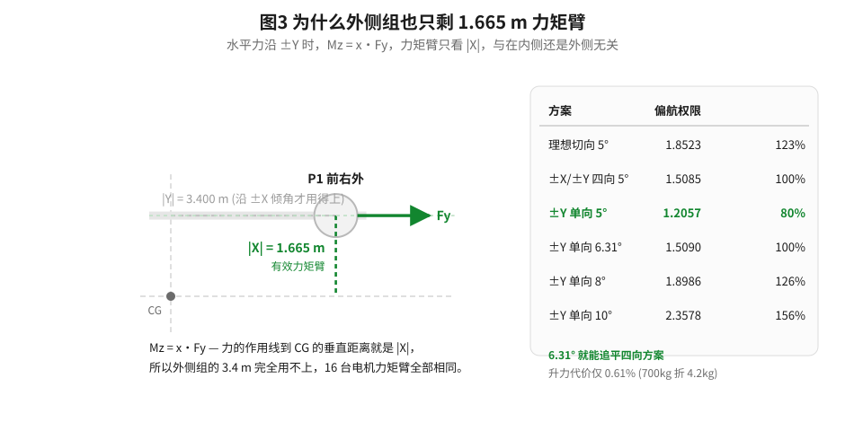
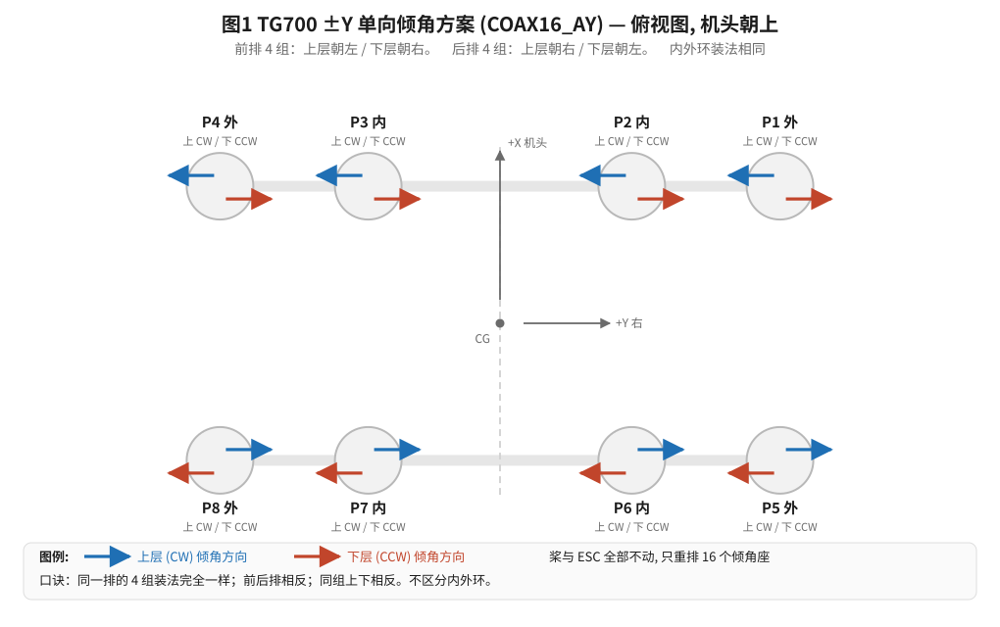
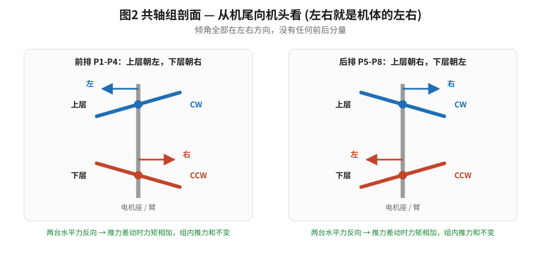

# TG700 偏航方案：±Y 单向倾角（v8.0 / COAX16_AY）

**适用约束**：电机座只能沿机体 **Y 轴**倾斜（向左或向右），**无法**沿 X 轴前后倾。
**机架串**：`COAX16_AY`　**参数**：`Q_FRAME_TYPE = 0`（默认，与机上现值一致）
**转向**：每组上层 CW / 下层 CCW —— **与现役硬件相同，桨和 ESC 一台都不用改**
**编制日期**：2026-08-31　**文档版本**：v1.0

---

## 0. 一页结论

### 0.1 三个直接回答

| 问题 | 回答 |
|---|---|
| **v4.0 固件能用吗？** | **能用，能安全飞。** 方向正确、解耦正确。但只能发挥这套底座 **80.5%** 的偏航能力（详见第 4 节） |
| 需要改桨或 ESC 吗？ | **完全不用。** 只需重排 16 个倾角座的朝向 |
| 偏航能力损失多少？ | 5° 时是四向方案（±X/±Y）的 **79.9%**。但**倾角加到 6.31° 就能追平**，代价仅 0.61% 升力（4.2 kg） |

### 0.2 安装规则（整个方案只有这一句）

> **前排 4 组（P1–P4）：上层朝左，下层朝右。**
> **后排 4 组（P5–P8）：上层朝右，下层朝左。**

内外环**不区分**，同一排的 4 组装法完全一样。左右一律以机体 `+Y = 右` 为准，不依赖站位。

### 0.3 强烈建议

**把倾角从 5° 加大到 8°–10°。** 失去了外侧组 3.4 m 的长力矩臂后，加大倾角是唯一
能把偏航能力拿回来的手段，而代价极小：

| 倾角 | 偏航权限 | 相对 5°(±Y) | 相对四向 5° | 升力损失 |
|---|---|---|---|---|
| 5° | 1.2057 | 1.00× | 0.80× | 0.38%（2.7 kg） |
| **6.31°** | 1.5090 | 1.25× | **1.00×** | 0.61%（4.2 kg） |
| **8°** | 1.8986 | 1.57× | **1.26×** | 0.97%（6.8 kg） |
| **10°** | 2.3578 | 1.96× | **1.56×** | 1.52%（10.6 kg） |
| 12° | 2.8142 | 2.33× | 1.87× | 2.19%（15.3 kg） |

---

## 1. 为什么外侧组也只剩 1.665 m 力矩臂

### 1.1 力矩臂由倾斜方向决定，不由电机位置决定

水平力产生的偏航力矩是 `Mz = x·Fy - y·Fx`：

- 水平力沿 **±X**（前后）时：`Mz = -y·Fx`，**力矩臂 = |Y|**
- 水平力沿 **±Y**（左右）时：`Mz = +x·Fy`，**力矩臂 = |X|**

现在只能沿 ±Y，所以每台电机的力矩臂都是 `|X| = 1.665 m`。而 8 个共轴组全部位于
`x = ±1.665 m`，于是——

> **16 台电机的偏航力矩臂完全相同。外侧组 3.4 m 的长臂彻底用不上了。**

这是几何事实，不是调参能补偿的。外侧组之所以在四向方案里更强，正是因为它们被允许
沿 ±X 倾斜从而借用 3.4 m 的 |Y| 作为力矩臂。



### 1.2 每台电机的偏航系数

```
偏航系数 = sin(倾角) × 力矩臂 + C_Q/C_T × R_prop
         = sin(5°) × 1.665 + 0.0056
         = 0.14512 + 0.0056
         = 0.15071  N·m per N of thrust
```

对比其他方案（均为 5°）：

| 方案 | 外侧组系数 | 内侧组系数 |
|---|---|---|
| 理想纯切向 | 0.33555（臂 3.786） | 0.20686（臂 2.309） |
| ±X/±Y 四向 | 0.30193（臂 3.400） | 0.15071（臂 1.665） |
| **±Y 单向（本方案）** | **0.15071（臂 1.665）** | **0.15071（臂 1.665）** |

---

## 2. 倾角方向推导

### 2.1 前提：转向不变

沿用现役硬件状态：每组**上层 CW、下层 CCW**。按 ArduPilot 惯例
（`AP_MOTORS_MATRIX_YAW_FACTOR_CW = -1`）：

- 上层 CW → 偏航因子为**负** → 需要 `Mz < 0`
- 下层 CCW → 偏航因子为**正** → 需要 `Mz > 0`

### 2.2 代入 `Mz = x·Fy`

| 位置 | 需要 `Mz < 0`（上层） | 需要 `Mz > 0`（下层） |
|---|---|---|
| 前排 `x = +1.665` | 需 `Fy < 0` → **朝左** | 需 `Fy > 0` → **朝右** |
| 后排 `x = -1.665` | 需 `Fy > 0` → **朝右** | 需 `Fy < 0` → **朝左** |

得到全表：

| 组 | 位置 | 排 | 环位 | 上层（CW） | 下层（CCW） |
|---|---|---|---|---|---|
| P1 | 前右外 | 前 | 外 | **朝左** `-Y` | **朝右** `+Y` |
| P2 | 前右内 | 前 | 内 | **朝左** `-Y` | **朝右** `+Y` |
| P3 | 前左内 | 前 | 内 | **朝左** `-Y` | **朝右** `+Y` |
| P4 | 前左外 | 前 | 外 | **朝左** `-Y` | **朝右** `+Y` |
| P5 | 后右外 | 后 | 外 | **朝右** `+Y` | **朝左** `-Y` |
| P6 | 后右内 | 后 | 内 | **朝右** `+Y` | **朝左** `-Y` |
| P7 | 后左内 | 后 | 内 | **朝右** `+Y` | **朝左** `-Y` |
| P8 | 后左外 | 后 | 外 | **朝右** `+Y` | **朝左** `-Y` |

**注意内外环完全相同** —— 这比之前任何方案都简单，因为力矩臂不再区分内外。





### 2.3 为什么同组上下必须反向

同一组上下两台的偏航因子一正一负。若两台朝同一方向倾，它们的水平力会相互抵消
（推力差动时力矩相减而非相加），偏航能力归零。

反向安装后，打偏航舵使上层 `+Δ`、下层 `-Δ`：两台的水平力都指向产生同向力矩的方向，
力矩相加；而**组内推力和 `(+Δ) + (-Δ) = 0` 保持不变**，所以对横滚、俯仰、升力的
扰动精确为零。

---

## 3. 解耦校核

校核脚本 `docs/analysis/tg700_verify_v8_schemes.py` 直接解析固件源码，实测：

| 项目 | 实测值 | 含义 |
|---|---|---|
| `Σ yaw×roll` | `0.000e+00` | 打偏航舵不产生横滚 |
| `Σ yaw×pitch` | `0.000e+00` | 打偏航舵不产生俯仰 |
| `Σ yaw` | `0.000e+00` | 打偏航舵不改变总升力 |
| 等推力静态偏航 | `0.000e+00` | 悬停不自转 |
| 偏航相对横滚 | 弱 **13.8** 倍 | 四向方案是 11.0 倍 |

**偏航仍在每个共轴组内部产生**，这是本架构的结构性优势：解耦与因子幅值无关，
只要同组上下等值反号即成立。

> `AP_MotorsMatrix::normalise_rpy_factors()` 会把偏航因子整体缩放到
> `max|yaw_fac| = 0.5`。本方案 16 台幅值相等，因此全部变成 ±0.5 ——
> 打偏航舵时 16 台电机**等量参与**，这是本约束下最高效的分配。

---

## 4. v4.0 固件能不能用（详细回答）

### 4.1 能用：方向与解耦都正确

v4.0 的偏航因子是 外侧 ±0.0971 / 内侧 ±0.0592，符号排布是**上层负、下层正**——
与本方案完全一致。而本方案的倾角方向正是从"上层需 `Mz<0`"推导出来的，所以：

- 每台电机的倾角力与自身反扭矩**同向相加**，不是相减
- 每组内偏航因子和为零 → 仍然**推力中性**，对横滚/俯仰/升力零扰动
- 偏航方向正确：右舵产生右转

**结论：按本方案装好倾角座后，v4.0 可以安全试飞。**

### 4.2 但浪费约 20% 的偏航能力

v4.0 的外/内因子比是 `0.0971 / 0.0592 = 1.640`。这个比值来自**纯切向假设**
（径向距离比 `3.786 / 2.309 = 1.639`）。而 ±Y 约束下真实比值是 **1.000**。

失配的后果：

```
v4.0 归一化后的因子：外侧 0.5000，内侧 0.3048
实际交付偏航力矩    ：0.9704
匹配混控（v8.0）    ：1.2057
v4.0 realises 80.5%  →  浪费 19.5%
```

原因：v4.0 认为外侧电机偏航效率高 1.64 倍，于是把偏航指令的大头压给外侧。但在 ±Y
约束下外侧并不比内侧强，结果是**外侧电机先饱和，内侧的余量却闲置**。

由于这架飞机的偏航本来就是限制项（08-24 日志里偏航控制器 75% 的时间处于饱和），
白扔 20% 是可惜的。v8.0 把 16 台因子改成相等，正好修掉这个失配。

### 4.3 两条路线

| | 用 v4.0 | 刷 v8.0 |
|---|---|---|
| 固件动作 | 不动 | 刷 `arduplane.apj`，`Q_FRAME_TYPE` 保持 0 |
| 倾角座 | 必须按第 2 节重排 | 同样必须按第 2 节重排 |
| 桨 / ESC | 不动 | 不动 |
| 偏航权限 | 0.9704（80.5%） | **1.2057（100%）** |
| 建议 | 可作为过渡验证 | **推荐** |

**关键提醒**：无论用哪个固件，**倾角座都必须先按第 2 节重排**。如果倾角还是
08-30 那种"对角半对"状态，两个固件都只能给出约 2% 的偏航能力。

---

## 5. 固件与参数

### 5.1 三种方案共存

v8.0 固件里三套混控由 `Q_FRAME_TYPE` 选择：

| `Q_FRAME_TYPE` | 机架串 | 倾角要求 | 说明 |
|---|---|---|---|
| **0 或 1** | `COAX16_AY` | 只需 ±Y | **本方案，默认，当前机械可实现** |
| 2 | `COAX16_AX4` | 需 ±X 与 ±Y | 底座若改造成能前后倾，用这个（权限 +25%） |
| 20 或 21 | `COAX16_COR` | 需 ±X/±Y + 反转 8 台 | 同转棋盘，权限无增益，仅备查 |

填 `{0,1,2,20,21}` 之外的值，飞控会**拒绝解锁**并报机架不支持，而不是静默套用
错误混控。

### 5.2 参数清单

| 参数 | 值 | 说明 |
|---|---|---|
| `Q_FRAME_CLASS` | 18 | TG700，不变 |
| `Q_FRAME_TYPE` | **0** | 机上现值就是 0，**无需改动** |
| `Q_M_THST_HOVER` | **0.44** | 现值 0.2 明显失真，必须改。直接影响偏航可用余量 |
| `Q_A_THR_MIX_MAN` | 0.1 → **0.25** | 现值偏低，压制姿态可用余量。分档小步上调 |
| `Q_M_YAW_HEADROOM` | 500 | 已是参数上限，无需再调 |

刷完固件重启，在 GCS 启动消息里确认机架串是 **`COAX16_AY`**。

---

## 6. 施工与验证

### 6.1 逐组检查表

**规则重述**：前排（P1–P4）上层朝左、下层朝右；后排（P5–P8）上层朝右、下层朝左。

| 组 | 排 | 上层朝向 | 下层朝向 | 上层角度 | 下层角度 | 上下反向？| 签字 |
|---|---|---|---|---|---|---|---|
| P1 | 前 | 左 `-Y` | 右 `+Y` | ____° | ____° | [ ] | ____ |
| P2 | 前 | 左 `-Y` | 右 `+Y` | ____° | ____° | [ ] | ____ |
| P3 | 前 | 左 `-Y` | 右 `+Y` | ____° | ____° | [ ] | ____ |
| P4 | 前 | 左 `-Y` | 右 `+Y` | ____° | ____° | [ ] | ____ |
| P5 | 后 | 右 `+Y` | 左 `-Y` | ____° | ____° | [ ] | ____ |
| P6 | 后 | 右 `+Y` | 左 `-Y` | ____° | ____° | [ ] | ____ |
| P7 | 后 | 右 `+Y` | 左 `-Y` | ____° | ____° | [ ] | ____ |
| P8 | 后 | 右 `+Y` | 左 `-Y` | ____° | ____° | [ ] | ____ |

### 6.2 整机自查（30 秒）

站在**机尾正后方朝机头看**：

1. 前排 8 台电机：4 个上层全部朝**左**，4 个下层全部朝**右**。
2. 后排 8 台电机：4 个上层全部朝**右**，4 个下层全部朝**左**。
3. 没有任何一台电机是前后倾的。
4. 每一组上下两台**方向相反**。

任何一条不符，停下重查，不要上电。

### 6.3 地面舵向验证（不可跳过）

飞机牢固系留，桨已装，周围 5 m 无人。

1. 解锁，QSTABILIZE，油门推到有明显转速但远未离地。
2. **打右舵**：机身应有**向右**（顺时针，机头朝右）的扭转趋势。
   若向左扭 → **立即收舵停机**，倾角装反了。
3. 打左舵，确认方向相反。
4. 落地回放日志，`RATE` 记录里 `YDes` 与 `Y` 必须**同号**。

日志判据：

```bash
python docs/analysis/tg700_v40_stick_signcheck.py "logs/<新日志>.log"
```

`yaw` 行的 slope **必须为正**。08-30 那次是 -0.00683（装反的典型特征）。

### 6.4 混控自检

```bash
python docs/analysis/tg700_verify_v8_schemes.py
```

对三套方案逐一校核解耦、因子幅值、倾角方向反推、悬停零偏置、权限对比。
应输出 `ALL CHECKS PASSED`。

---

## 7. 附录

### 7.1 偏航因子（固件实现值）

```c
#define TG700_YAW_ALL   ( 0.0443f)   // (sin5° × 1.665 + 0.0056) / 3.4
#define TG700_YA_CW     (-TG700_YAW_ALL)   // 上层 CW
#define TG700_YA_CCW    ( TG700_YAW_ALL)   // 下层 CCW
```

16 台电机幅值全部相同，符号按 上负 / 下正 交替。

### 7.2 三方案权限对比（校核脚本实测，5°）

| 机架串 | 偏航权限 | 相对 AX4 | 偏航相对横滚 |
|---|---|---|---|
| `COAX16_AY`（本方案） | 1.2057 | 79.9% | 弱 13.8 倍 |
| `COAX16_AX4` | 1.5085 | 100.0% | 弱 11.0 倍 |
| `COAX16_COR` | 1.5085 | 100.0% | 弱 11.0 倍 |

### 7.3 相关文件

| 文件 | 用途 |
|---|---|
| `libraries/AP_Motors/AP_MotorsMatrix_TG700.cpp` | 混控实现（v8.0，三方案） |
| `docs/analysis/tg700_yonly_tilt_design.py` | 本方案的完整推导与 v4.0 可用性分析 |
| `docs/analysis/tg700_verify_v8_schemes.py` | 三方案混控自检 |
| `docs/analysis/tg700_v40_stick_signcheck.py` | 用摇杆回归验证舵向符号 |
| `docs/analysis/gen_yonly_svg.py` | 本文三张示意图的生成脚本 |
| `docs/TG700_偏航控制定案_四向倾角约束_v6.md` | 四向方案（`COAX16_AX4`）的推导 |
| `docs/TG700_方案B_同转棋盘_安装指南手册_v5.md` | 同转棋盘方案（`COAX16_COR`）的手册 |
| `docs/TG700_电机倾角安装方向与偏航机理.md` | **已勘误**的旧文档，左右口诀有误，勿据以施工 |
