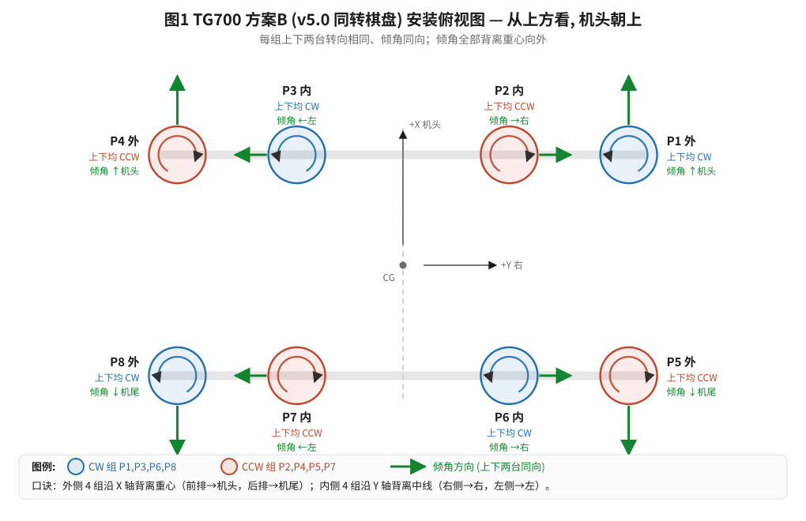
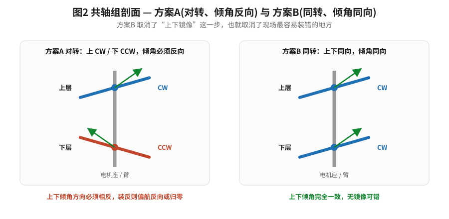
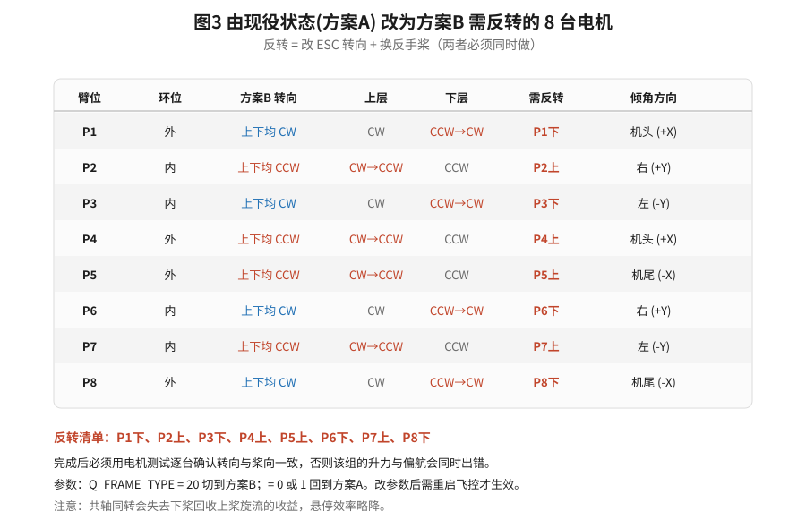

# TG700 方案B（v5.0 同转棋盘）安装指南手册

**适用机型**：天工-700 十六旋翼共轴复合翼
**适用固件**：`AP_MotorsMatrix_TG700.cpp` v7.0 及以后（机架串 `COAX16_COR`）
**约束前提**：电机座只能沿机体 X 轴或 Y 轴倾斜（朝机头 / 机尾 / 左 / 右 四者之一）
**编制日期**：2026-08-31
**文档版本**：v1.0

---

## 0. 先读这一页

### 0.1 本手册解决的问题

2026-08-30 的两次试飞（`15-32-20`、`15-39-18`）暴露了一个反复出现的问题：**倾角座装反了**。
根因不是代码，而是旧文档 `TG700_电机倾角安装方向与偏航机理.md` 里的"左手/右手"口诀写错了左右。
本手册**完全不使用"左手/右手""顺着看/逆着看"这类依赖观察者站位的表述**，
所有方向一律用机体轴 `+X / -X / +Y / -Y` 表达，并同时给出中文别名（机头 / 机尾 / 右 / 左）。

### 0.2 方案B 与方案A 的关系（必读，涉及选型）

固件 v7.0 里同时内置两套混控，由 `Q_FRAME_TYPE` 选择：

| | 方案A（默认） | 方案B（本手册） |
|---|---|---|
| `Q_FRAME_TYPE` | 0 或 1 | **20** |
| 机架串（日志/GCS 可见） | `COAX16_AX4` | `COAX16_COR` |
| 共轴组内转向 | 上 CW / 下 CCW（**对转**） | 上下**同向**，组间棋盘交替 |
| 偏航来源 | 同组内上下差动推力 | 组与组之间差动推力 |
| 倾角安装 | 同组上下**必须反向**（易错） | 同组上下**同向**，全部朝外（简单） |
| 偏航权限 | 基准 | **完全相同**（比值 1.0000） |
| 桨与 ESC | **无需改动**（即现役状态） | 需反转 **8 台**电机 |
| 共轴气动效率 | 下桨回收上桨旋流，效率较优 | 同转，失去该收益，悬停效率略降 |
| 单电机失效时的姿态扰动 | 较小（偏航对推力中性） | 较大（偏航会跨机体重分配推力） |

**诚实的结论**：方案B **不会**提高偏航权限，一个百分点都不会。
解析证明每台电机的偏航贡献都是 `sin(倾角) × 力矩臂 + 反扭矩`，与转向排布方式无关。

方案B 唯一的实质好处是**安装规则大幅简化**：取消了"同组上下倾角必须反向"这一步，
而这正是 08-30 那次装错的地方。如果现场返工的可靠性是主要矛盾，方案B 值得做；
如果只想尽快恢复偏航能力，**方案A 更划算**（不动桨和 ESC，只重排 16 个倾角座）。

> **提高偏航权限的唯一有效途径是加大倾角**，两方案都一样。
> 5° → 10° 得 1.97 倍，→ 15° 得 2.92 倍，→ 18° 得 3.48 倍；
> 代价是升力损失 `cos θ`：10° 损失 1.5%（700 kg 折 10.6 kg），15° 损失 3.4%（23.9 kg），
> 18° 损失 4.9%（34.3 kg）。

### 0.3 安全红线

1. **改完必须做地面舵向验证**（第 6 节），确认右舵产生右转（机头朝右）后才允许试飞。
2. 反转转向时，**改 ESC 转向和换反手桨必须同时做**。只改一个，该电机会产生向下的推力。
3. 8 台电机改完后，逐台做电机测试，核对转向与桨向一致。
4. 方案B 的 `Q_FRAME_TYPE = 20` 与倾角/转向硬件是**配套的**。参数与硬件不匹配会导致偏航反向。

---

## 1. 坐标与方向定义（唯一基准）

采用 ArduPilot NED 体轴系。请把飞机放平、站在**机尾正后方朝机头看**建立直觉，
但所有指令仍以机体轴为准，不依赖你站哪：

| 轴 | 正方向 | 中文别名 |
|---|---|---|
| X | 机头方向 | `+X` = 机头，`-X` = 机尾 |
| Y | 右翼方向 | `+Y` = 右，`-Y` = 左 |
| Z | 向下 | — |

**偏航正方向**：`+` 为机头向右转（从上方看为顺时针）。右舵 = 正偏航 = 机头向右。

**转向的定义**：一律**从飞机上方俯视**判断。CW = 顺时针，CCW = 逆时针。
（上层和下层电机都从上方看，不要从下方看下层电机。）

### 1.1 八个共轴组的位置

实测几何：翼展 11.0 m，外侧间距 6.8 m（`Y = ±3.4 m`），内侧间距 3.2 m（`Y = ±1.6 m`），
前后间距 3.33 m（`X = ±1.665 m`）。

```
                        机头方向 (+X)
                              ^
                              |
   P4(M7,8)    P3(M5,6)      |     P2(M3,4)  P1(M1,2)   ← 前排 X=+1.665
   左外 CAN2   左内 CAN2      |     右内 CAN1  右外 CAN1
      |          |          [CG]       |          |
   P8(M15,16)  P7(M13,14)    |    P6(M11,12) P5(M9,10)  ← 后排 X=-1.665
   左外 CAN2   左内 CAN2      |     右内 CAN1  右外 CAN1
                              |
                              v
                         机尾方向 (-X)
```

| 组 | 位置 | X (m) | Y (m) | 环位 | 电机 | CAN / ESC | SERVO |
|---|---|---|---|---|---|---|---|
| P1 | 前右外 | +1.665 | +3.4 | 外 | M1(上) M2(下) | CAN1 ESC 0,1 | SERVO5,6 |
| P2 | 前右内 | +1.665 | +1.6 | 内 | M3(上) M4(下) | CAN1 ESC 2,3 | SERVO7,8 |
| P3 | 前左内 | +1.665 | -1.6 | 内 | M5(上) M6(下) | CAN2 ESC 0,1 | SERVO13,14 |
| P4 | 前左外 | +1.665 | -3.4 | 外 | M7(上) M8(下) | CAN2 ESC 2,3 | SERVO15,16 |
| P5 | 后右外 | -1.665 | +3.4 | 外 | M9(上) M10(下) | CAN1 ESC 4,5 | SERVO9,10 |
| P6 | 后右内 | -1.665 | +1.6 | 内 | M11(上) M12(下) | CAN1 ESC 6,7 | SERVO11,12 |
| P7 | 后左内 | -1.665 | -1.6 | 内 | M13(上) M14(下) | CAN2 ESC 4,5 | SERVO17,18 |
| P8 | 后左外 | -1.665 | -3.4 | 外 | M15(上) M16(下) | CAN2 ESC 6,7 | SERVO19,20 |

---

## 2. 为什么倾角只能沿 ±X / ±Y，以及怎么选

### 2.1 机械约束

理想的偏航倾角应当是**纯切向**——垂直于"机体中心到电机"的连线。但底座结构做不到，
只能沿机体 X 轴或 Y 轴倾斜，即 0° / 90° / 180° / 270° 四个方向之一。

### 2.2 四向里怎么选力矩臂最大的

水平力产生的偏航力矩为 `Mz = x·Fy - y·Fx`。于是：

- 水平力沿 **±X** 时，`Mz = -y·Fx`，**力矩臂 = |Y|**
- 水平力沿 **±Y** 时，`Mz = +x·Fy`，**力矩臂 = |X|**

代入几何：

| 环位 | \|Y\| | \|X\| | 取大者 | 倾斜轴 | 力矩臂 |
|---|---|---|---|---|---|
| 外侧（P1,P4,P5,P8） | 3.400 | 1.665 | \|Y\| | **±X**（机头/机尾） | 3.400 m |
| 内侧（P2,P3,P6,P7） | 1.600 | 1.665 | \|X\| | **±Y**（左/右） | 1.665 m |

相对理想切向方案（力矩臂为径向距离 3.786 / 2.309 m），本方案保留 **83.5%** 的偏航权限
（外侧 89.8%，内侧 72.1%）。这是机械约束下的最优解，不是妥协余地问题。

### 2.3 取消原 2° 向心分量

旧方案除 5° 切向外还有 2° 向心分量。四向约束下无法与主倾角叠加，**只保留单一 5°**。
油门因子相应由 `cos5°·cos2°` 改为 `cos5° = 0.9962`。

---

## 3. 方案B 主表（施工依据）

### 3.1 转向：棋盘交替

| 转向 | 组 | 环位构成 |
|---|---|---|
| **CW**（顺时针） | P1, P3, P6, P8 | 2 外 + 2 内 |
| **CCW**（逆时针） | P2, P4, P5, P7 | 2 外 + 2 内 |

每种转向各含 2 外 + 2 内，因此横滚、俯仰、升力三轴精确平衡（校核脚本实测和为 0.000e+00）。

### 3.2 总表：转向 + 倾角

**同一组的上下两台电机：转向相同，倾角方向也相同。**

| 组 | 位置 | 环位 | 转向（上下均） | 倾斜轴 | **倾角朝向（上下两台都一样）** |
|---|---|---|---|---|---|
| P1 | 前右外 | 外 | **CW** | ±X | **`+X` 机头** |
| P2 | 前右内 | 内 | **CCW** | ±Y | **`+Y` 右** |
| P3 | 前左内 | 内 | **CW** | ±Y | **`-Y` 左** |
| P4 | 前左外 | 外 | **CCW** | ±X | **`+X` 机头** |
| P5 | 后右外 | 外 | **CCW** | ±X | **`-X` 机尾** |
| P6 | 后右内 | 内 | **CW** | ±Y | **`+Y` 右** |
| P7 | 后左内 | 内 | **CCW** | ±Y | **`-Y` 左** |
| P8 | 后左外 | 外 | **CW** | ±X | **`-X` 机尾** |

### 3.3 口诀：全部朝外

方案B 的倾角规则可以压缩成一句话：

> **每一台电机都向外倾——外侧 4 组沿 X 轴背离重心，内侧 4 组沿 Y 轴背离中线。**

展开：

- **外侧组沿 X 轴，背离重心**：前排（P1、P4）朝机头，后排（P5、P8）朝机尾。
- **内侧组沿 Y 轴，背离中线**：右侧（P2、P6）朝右，左侧（P3、P7）朝左。

这条口诀**不含左右手、不含观察方向**，且已由校核脚本对 16 台电机逐一验证通过。



### 3.4 与方案A 的关键差别：没有"上下镜像"

方案A 要求同组上下两台倾角**反向**，这是 08-30 装错的环节。方案B 里上下**同向**，
这一步被彻底取消。



---

## 4. 硬件改动清单

### 4.1 需要反转转向的 8 台电机

现役状态是方案A（上 CW / 下 CCW）。改为方案B 时：

- 方案B 里为 **CW** 的组（P1、P3、P6、P8）：上层已是 CW，**反转下层**
- 方案B 里为 **CCW** 的组（P2、P4、P5、P7）：下层已是 CCW，**反转上层**

**反转清单（共 8 台）**：

> **P1下、P2上、P3下、P4上、P5上、P6下、P7上、P8下**

| 组 | 方案B 转向 | 上层 | 下层 | 需反转 | 倾角朝向 |
|---|---|---|---|---|---|
| P1 | CW | CW（不变） | CCW → **CW** | **P1下** | 机头 `+X` |
| P2 | CCW | CW → **CCW** | CCW（不变） | **P2上** | 右 `+Y` |
| P3 | CW | CW（不变） | CCW → **CW** | **P3下** | 左 `-Y` |
| P4 | CCW | CW → **CCW** | CCW（不变） | **P4上** | 机头 `+X` |
| P5 | CCW | CW → **CCW** | CCW（不变） | **P5上** | 机尾 `-X` |
| P6 | CW | CW（不变） | CCW → **CW** | **P6下** | 右 `+Y` |
| P7 | CCW | CW → **CCW** | CCW（不变） | **P7上** | 左 `-Y` |
| P8 | CW | CW（不变） | CCW → **CW** | **P8下** | 机尾 `-X` |



### 4.2 每台反转电机的两步操作（必须同时做）

1. **改 ESC 转向**：用炫动上位机把该 ESC 的转向参数取反。改完记下 Node ID 与 ESC Index。
2. **换反手桨**：把该电机的桨换成相反手向的桨。

> **只做其中一步的后果**：桨向与转向不匹配，该电机产生**向下**的推力。
> 起飞瞬间会同时出现升力缺口和大幅姿态扰动，属于危险故障。

### 4.3 倾角座重排（16 台）

按 3.2 节总表逐组调整。方案B 下同组上下同向，一组两台可以一次对齐。

---

## 5. 逐组施工步骤

对 P1 到 P8 依次执行，每组完成后打勾并签字。

**每组通用流程**：

1. 查表确认本组的**转向**与**倾角朝向**（3.2 节）。
2. 如本组在反转清单内，先完成 4.2 节两步（ESC 转向 + 反手桨）。
3. 松开上层电机座，把倾斜方向对准表中朝向，用角度尺确认 **5° ± 0.5°**，紧固。
4. 下层电机座调到**与上层完全相同**的朝向，同样 5° ± 0.5°，紧固。
5. 站在机尾后方目视：本组上下两台的倾斜方向应当**一致**（不是镜像）。
6. 记录实测角度。

**逐组检查表**：

| 组 | 转向 | 倾角朝向 | 是否需反转 | 上层角度 | 下层角度 | 上下同向？| 签字 |
|---|---|---|---|---|---|---|---|
| P1 | CW | 机头 `+X` | P1下 | ____° | ____° | [ ] | ____ |
| P2 | CCW | 右 `+Y` | P2上 | ____° | ____° | [ ] | ____ |
| P3 | CW | 左 `-Y` | P3下 | ____° | ____° | [ ] | ____ |
| P4 | CCW | 机头 `+X` | P4上 | ____° | ____° | [ ] | ____ |
| P5 | CCW | 机尾 `-X` | P5上 | ____° | ____° | [ ] | ____ |
| P6 | CW | 右 `+Y` | P6下 | ____° | ____° | [ ] | ____ |
| P7 | CCW | 左 `-Y` | P7上 | ____° | ____° | [ ] | ____ |
| P8 | CW | 机尾 `-X` | P8下 | ____° | ____° | [ ] | ____ |

### 5.1 施工后的整机自查（30 秒完成）

站在**机头正前方**，俯视整机，检查四条：

1. 外侧四组（P1、P4、P5、P8）的倾角**都沿前后方向**，前两组朝机头、后两组朝机尾。
2. 内侧四组（P2、P3、P6、P7）的倾角**都沿左右方向**，右两组朝右、左两组朝左。
3. 每一组的上下两台**朝向一致**。
4. 转向呈棋盘：P1、P3、P6、P8 顺时针；P2、P4、P5、P7 逆时针。

任何一条不符，停下重查，不要上电。

---

## 6. 参数设置与地面验证

### 6.1 参数

| 参数 | 值 | 说明 |
|---|---|---|
| `Q_FRAME_CLASS` | 18 | TG700（不变） |
| `Q_FRAME_TYPE` | **20** | 切到方案B `COAX16_COR`。改完**必须重启飞控** |
| `Q_M_THST_HOVER` | **0.44** | 现值 0.2 明显失真，必须改。影响油门曲线中点与偏航可用余量 |
| `Q_M_YAW_HEADROOM` | 500 | 已是参数上限（范围 0–500），无需再调 |
| `Q_A_THR_MIX_MAN` | 0.15 → 0.25 | 现值 0.1 偏低，压制姿态可用余量。分档小步上调 |

改参数后重启，在 GCS 的启动消息里确认机架串是 **`COAX16_COR`**。
若显示 `COAX16_AX4`，说明 `Q_FRAME_TYPE` 没生效；若飞控拒绝解锁并报机架不支持，
说明 `Q_FRAME_TYPE` 填了 0/1/20/21 之外的值（v7.0 会主动拒绝未知类型，
以免静默套用错误混控）。

### 6.2 地面舵向验证（不可跳过）

**准备**：飞机牢固系留或压重，桨已装，周围 5 m 无人。

1. 解锁，QSTABILIZE 模式，油门推到刚有明显转速但远未离地。
2. **打右舵**（`+` 偏航）。观察：
   - 正确：机身有**向右**（顺时针，机头朝右）的扭转趋势。
   - 错误：机身向左扭 → **立即收舵停机**，倾角装反了，回到第 5 节重查。
3. **打左舵**，确认扭转方向相反。
4. 落地后回放日志，检查 `RATE` 记录：`YDes` 与 `Y` 应**同号**。

**日志判据**（用现成脚本）：

```bash
python docs/analysis/tg700_v40_stick_signcheck.py "logs/<新日志>.log"
```

该脚本用飞手摇杆（外生输入）回归实际角速率，输出 `yaw` 行的 slope。
**slope 必须为正**。08-30 那次的值是 -0.00683（3480 个右舵样本平均 -3.71 deg/s），
即典型的装反特征。

> 不要用"控制器输出 vs 实际角速率"的相关性判断符号——闭环反馈会让三个轴
> 全都显示为负相关，是伪像。

### 6.3 混控自检（改代码后跑）

```bash
python docs/analysis/tg700_verify_v7_dual_scheme.py
```

对两套方案逐一校核：转向排布、解耦（打偏航舵对横滚/俯仰/升力的扰动必须为 0）、
倾角方向反推、偏航权限对比、悬停零偏置、反转清单。应输出 `ALL CHECKS PASSED`。

---

## 7. 常见错误与对照

| 现象 | 最可能的原因 | 处置 |
|---|---|---|
| 一离地就朝一个方向自转，越来越快 | 倾角整体装反，偏航成正反馈 | 停飞，按 3.2 节全查 |
| 偏航"能动但极弱"，打满舵只有几 deg/s | 部分组装反，与正确组相互抵消 | 逐组核对，尤其查上下是否同向 |
| 某组一上电就压不住，姿态剧烈扰动 | 该电机只改了 ESC 转向或只换了桨 | 断电，核对该电机桨向与转向 |
| GCS 显示 `COAX16_AX4` | `Q_FRAME_TYPE` 未生效 | 确认为 20 并重启飞控 |
| 拒绝解锁，报机架不支持 | `Q_FRAME_TYPE` 不在 {0,1,20,21} | 改为 20（方案B）或 0（方案A） |
| 悬停油门比方案A 高一些 | 共轴同转失去旋流回收，属预期 | 重新标定 `Q_M_THST_HOVER` |

---

## 8. 附录

### 8.1 偏航因子（固件实现值）

幅值 `= [sin(倾角) × 力矩臂 + Q/T] / Y_max`，其中 `Q/T = C_Q/C_T × R_prop ≈ 0.0056 m`：

- 外侧：`(0.08716 × 3.400 + 0.0056) / 3.4 = 0.0888`
- 内侧：`(0.08716 × 1.665 + 0.0056) / 3.4 = 0.0443`

符号跟随转向（CW 取负、CCW 取正，遵循 ArduPilot 的 `YAW_FACTOR_CW = -1` 约定）。

> `AP_MotorsMatrix::normalise_rpy_factors()` 会把 yaw 因子整体缩放到 `max|yaw_fac| = 0.5`，
> 因此最终只有**外侧:内侧的比值**（0.0443/0.0888 = 0.499）影响混控，绝对幅值仅用于自证。
> 这也是偏航"看起来和横滚一样强、实际弱 11 倍"的原因——`sin5° = 0.0872` 这个损失
> 在归一化中被抹掉，PID 看不见。

### 8.2 校核实测结果摘要

| 项目 | 方案A | 方案B |
|---|---|---|
| 打偏航舵的横滚扰动 `Σ yaw×roll` | 0.000e+00 | 0.000e+00 |
| 打偏航舵的俯仰扰动 `Σ yaw×pitch` | 0.000e+00 | 0.000e+00 |
| 打偏航舵的总推力变化 `Σ yaw` | 0.000e+00 | 0.000e+00 |
| 单位归一化指令的偏航力矩 | 1.5085 | **1.5085** |
| 偏航相对横滚的强弱 | 弱 11.0 倍 | 弱 11.0 倍 |
| 等推力下的静态偏航偏置 | 0.000e+00 | 0.000e+00 |
| 需反转电机数 | 0 | 8 |

### 8.3 相关文件

| 文件 | 用途 |
|---|---|
| `libraries/AP_Motors/AP_MotorsMatrix_TG700.cpp` | 混控实现（v7.0，两方案） |
| `docs/analysis/tg700_verify_v7_dual_scheme.py` | 两方案混控自检 |
| `docs/analysis/tg700_v40_stick_signcheck.py` | 用摇杆回归验证舵向符号 |
| `docs/analysis/gen_v5_install_svg.py` | 本手册三张示意图的生成脚本 |
| `docs/TG700_偏航控制定案_四向倾角约束_v6.md` | 方案A 的完整推导与定案文档 |
| `docs/TG700_电机倾角安装方向与偏航机理.md` | **已勘误**的旧文档，其左右口诀有误，勿据以施工 |
