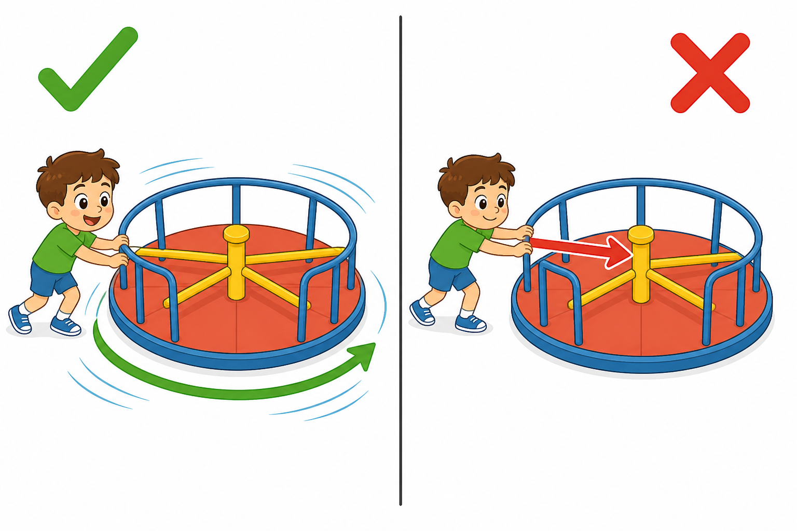
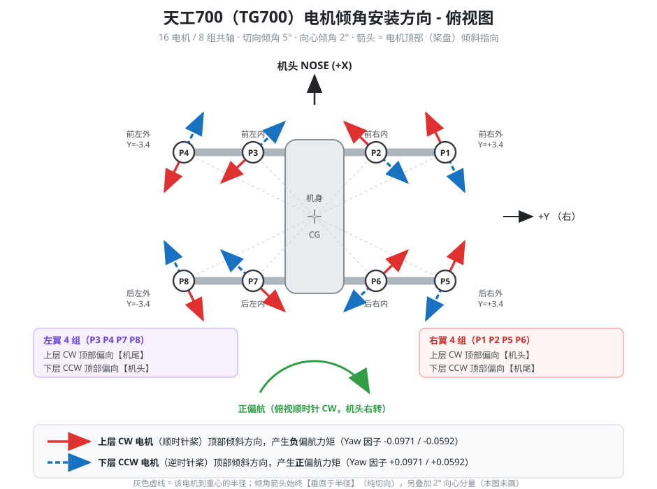
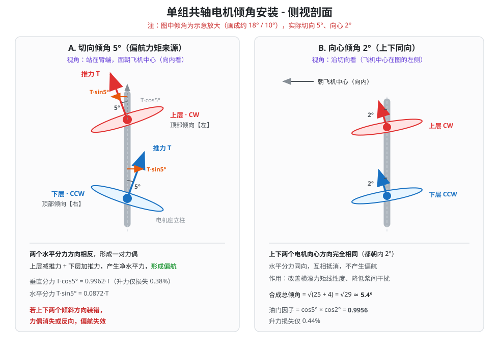
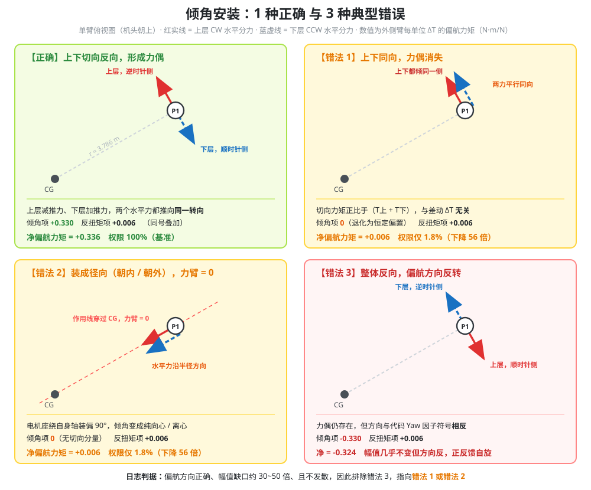

# 天工700（TG700）电机倾角安装方向 · 偏航机理 · 计算过程

> ## 【重要】勘误与失效声明（2026-08-31）
>
> **本文第 2 章、第 6 章已作废，请改用《TG700_偏航控制定案_四向倾角约束_v6.md》。**
>
> **失效原因：** 电机座结构上只能沿机体 X 轴或 Y 轴倾斜（朝机头 / 机尾 / 左 / 右四个方向之一），
> 无法实现本文假设的"纯切向"倾斜（外侧需偏 26.1°，内侧需偏 46.2°）。新文档给出了四向约束下的
> 最优方案（外侧沿 ±X、内侧沿 ±Y，保留 83.5% 权限）。
>
> **勘误（重要，这是 2026-08-30 现场装反的直接原因）：** 本文第 2.2 节的"万能规则"与第 6.1 / 6.2 节
> 的现场清单，**左右方向与本文自身的公式、第 2.3 节逐臂表、以及三张示意图相反**：
>
> | 位置 | 原文（错） | 正确 |
> |---|---|---|
> | 2.2 万能规则 | 上层 CW 向**左手边**，下层 CCW 向**右手边** | 上层 CW 向**右手边**，下层 CCW 向**左手边** |
> | 6.1 第 2 / 3 步 | 上层向**左手边**，下层向**右手边** | 上层**右手边**，下层**左手边** |
> | 6.2 判定表 | "上层倾左、下层倾右"= 正确 | 这一行是**错法**；标为"错法 3"的那一行才**正确** |
>
> **仍然有效的部分：** 第 1 章（机理科普）、第 2.3 节逐臂表、第 3 章、第 4 章（计算推导）、
> 第 5 章（日志证据链）、第 7.1.1 节（`Q_M_THST_HOVER` 标定）。

| 项目 | 内容 |
|---|---|
| 机型 | TG700 / COAX16（16 电机 · 8 组共轴） |
| 全机重量 | 700 kg |
| 固件 | ArduPlane V4.7.0-dev (3863214b) |
| 混控文件 | `libraries/AP_Motors/AP_MotorsMatrix_TG700.cpp` |
| 分析依据 | `logs/2026-08-24 16-48-11.log` |
| 文档版本 | 2026-08-30 |

---

## 摘要（先看这一页）

**结论 1 - 倾角方向没有装反，但切向分量几乎没有起作用。**

日志证明：飞手打右舵时飞机确实往右转（符号正确），但速率只有指令的 **1~3%**。
缺口约 **30~50 倍**，与"切向倾角完全失效、只剩螺旋桨反扭矩"的理论预测（56 倍）高度吻合。

**结论 2 - 最可能的两种安装错误：**

| | 错误形态 | 后果 |
|---|---|---|
| 错法 1 | 同一组的上、下电机切向倾角**朝同一方向** | 力偶消失，差动完全失效 |
| 错法 2 | 电机座绕自身轴装偏 90°，倾角变成**朝内/朝外**（径向） | 力臂为 0，不产生偏航 |

**结论 3 - 调参已经无路可走。**

偏航输出 74.9% 的时间处于饱和（超出 正负1 的上限），53% 的时间超过 2 倍上限；
积分项被抗饱和逻辑冻结；偏航 P 增益已经是俯仰的 10.9 倍。**继续加增益或加 headroom 没有任何作用。**

**行动优先级：**

1. 现场核查 16 个电机座的倾角朝向（见第 6 章清单），不需要拆机，目视加手机水准仪即可
2. 同时把 `Q_A_RATE_Y_MAX` 从 100 °/s 降到物理可达范围，恢复摇杆线性手感
3. 长期：切向倾角由 5° 增大到 **18~20°**（见第 7 章计算）

---

# 第 1 章　机理说明（小学生也能听懂）

## 1.1 想让转盘转起来，要往哪个方向推？



小朋友推游乐场的转盘：

- **左边**：他沿着转盘的**边缘方向**推（顺着圆圈的切线推），转盘飞快地转起来【对】
- **右边**：他对着转盘**中心的柱子**推（顺着半径推），转盘一动不动【错】

用一样的力气，方向不对就白费。原因很简单：

> 推力要想让东西转，它的方向必须**偏离中心**。
> 正对着中心推，力全部被中心的柱子顶住了，一点也不会转。

这就是物理里说的"**力臂**"。力臂等于从中心到"力的作用线"的垂直距离。
正对着中心推，力臂为 0，所以转动效果也是 0。

## 1.2 天工700 是怎么"转弯"的？

天工700 有 16 个电机，装在 8 根支架上，支架从机身向外伸出去，像一个大风车。

每个电机都是**向下吹风**的（这样飞机才能飞起来）。
但如果 16 个电机全都**笔直**向下吹风，飞机只会上下动，**永远不会转弯**。

所以工程师把每个电机座都**歪了 5°**：

```
      笔直向下吹                    歪 5° 向下吹
          |                            \
          |                             \
          V                              V
      只有向下的力              向下的力 + 一点点侧向的力
      （飞机往上飞）            （侧向的力让飞机转圈）
```

这"一点点侧向的力"，就相当于小朋友沿着转盘边缘推的那一下。
**16 个电机的侧向力加在一起，飞机就能转弯了。**

## 1.3 为什么要上下两个电机配一对？

天工700 的电机是**两个一组，上下叠在一起**（叫"共轴"）。

- 上面那个电机的桨**顺时针**转
- 下面那个电机的桨**逆时针**转

这一对里，两个电机的 5° 要**歪向相反的方向**：

```
      上电机  <-- 歪向左边，侧向力往左推
      ==========================
      下电机  --> 歪向右边，侧向力往右推
```

平时飞机不转弯的时候，上下两个电机吹一样大的风，
**左边的力和右边的力刚好一样大，互相抵消**，飞机不转。

想要往右转弯的时候，飞控就让：

- **下电机吹大一点**（往右推的力变大）
- **上电机吹小一点**（往左推的力变小）

结果：**往右的力赢了，飞机往右转。** 想往左转就反过来。

> 这就像两个人拔河：平时力气一样大，绳子不动；
> 谁力气大一点，绳子就往谁那边走。

## 1.4 装错了会怎样？

**如果上下两个电机的 5° 歪向了同一边**（错法 1）：

那就不是拔河了，而是两个人**朝同一个方向拉**。
不管让谁用力大一点，两个人的力加起来的**总方向都不变**，
飞控让下电机吹大、上电机吹小，总的侧向力**一点都没变**。飞机就转不动了。

**如果 5° 歪成了对着机身中心**（错法 2）：

就像小朋友对着转盘中心的柱子推，力臂为 0，白费力气，飞机转不动。

**现在天工700 的症状**：飞手把方向舵**打到最大**，飞机只慢慢地转，
转的速度只有应该有的三十分之一到五十分之一。这正好就是上面两种装错的表现。

---

# 第 2 章　正确的安装朝向方案

## 2.1 总览图



## 2.2 万能规则（不用记表格）

> **站在任意一根臂的末端，面朝飞机中心（向内看）：**
>
> - **上层 CW 电机**（顺时针桨）：机体顶部向你的 **左手边** 倾斜 5°
> - **下层 CCW 电机**（逆时针桨）：机体顶部向你的 **右手边** 倾斜 5°

这条规则对 P1 到 P8 全部 8 根臂**都成立**，与臂在前后左右哪个位置无关。

换算到机体坐标系，就是一条更好记的规律：

| | 上层 CW 电机顶部偏向 | 下层 CCW 电机顶部偏向 |
|---|---|---|
| **右翼** 4 组（P1 P2 P5 P6） | **机头**方向 | **机尾**方向 |
| **左翼** 4 组（P3 P4 P7 P8） | **机尾**方向 | **机头**方向 |

## 2.3 逐臂精确方向表

坐标定义（ArduPilot NED 体轴系）：**+X 为机头，+Y 为右侧，+Z 向下**；正偏航为俯视顺时针。

切向倾斜方向按下式计算（详见第 4 章推导）：

- 上层 CW（产生负偏航）：单位方向 = (+r_y , -r_x) / |r|
- 下层 CCW（产生正偏航）：单位方向 = (-r_y , +r_x) / |r|

| 臂位 | 位置 | 坐标 (X, Y) m | 半径 \|r\| m | 上层 CW 顶部偏向 | 下层 CCW 顶部偏向 |
|:---:|---|:---:|:---:|---|---|
| **P1** | 前右外 | (+1.665, +3.4) | 3.786 | 机头，偏左 26.1° | 机尾，偏右 26.1° |
| **P2** | 前右内 | (+1.665, +1.6) | 2.309 | 机头，偏左 46.2° | 机尾，偏右 46.2° |
| **P3** | 前左内 | (+1.665, -1.6) | 2.309 | 机尾，偏左 46.2° | 机头，偏右 46.2° |
| **P4** | 前左外 | (+1.665, -3.4) | 3.786 | 机尾，偏左 26.1° | 机头，偏右 26.1° |
| **P5** | 后右外 | (-1.665, +3.4) | 3.786 | 机头，偏右 26.1° | 机尾，偏左 26.1° |
| **P6** | 后右内 | (-1.665, +1.6) | 2.309 | 机头，偏右 46.2° | 机尾，偏左 46.2° |
| **P7** | 后左内 | (-1.665, -1.6) | 2.309 | 机尾，偏右 46.2° | 机头，偏左 46.2° |
| **P8** | 后左外 | (-1.665, -3.4) | 3.786 | 机尾，偏右 26.1° | 机头，偏左 26.1° |

> **角度读法**："机头，偏左 26.1°" 表示从机头方向（+X）朝左侧（-Y）转 26.1°。
> 这个方向必然与该臂的半径**垂直**（纯切向），这是校核安装是否正确的最快判据。

## 2.4 两个倾角分量的叠加



代码中定义了**两个**倾角：

```cpp
#define TG700_TILT_TANGENTIAL_DEG   5.0f   // 切向：产生偏航，上下相反
#define TG700_TILT_INWARD_DEG       2.0f   // 向心：上下相同，不产生偏航
```

| 分量 | 角度 | 上下关系 | 作用 |
|---|:---:|---|---|
| 切向 | 5° | **上下必须相反** | **唯一的偏航力矩来源** |
| 向心 | 2° | **上下完全相同**（都朝机身中心） | 改善横滚线性度、降低桨间干扰 |
| 合成 | **5.39°** | - | 电机轴实际偏离铅垂线的角度 |

合成角计算：

```
theta_total = sqrt(5^2 + 2^2) = sqrt(29) = 5.385°
```

以 P1 上层 CW 为例，合成后的实际指向：

```
切向单位向量（机体系） = (+3.4, -1.665)/3.786 = (+0.898, -0.440)
向心单位向量（机体系） = (-1.665, -3.4)/3.786 = (-0.440, -0.898)

合成 = 5 × (+0.898, -0.440) + 2 × (-0.440, -0.898)
     = (4.490 - 0.880,  -2.200 - 1.796)
     = (+3.610, -3.996)

指向角 = atan2(-3.996, +3.610) = -47.9°   （即机头方向偏左 47.9°）
幅值   = sqrt(3.610^2 + 3.996^2) = 5.385°   与 theta_total 一致
```

---

# 第 3 章　三种错误安装的定量后果



以**外侧臂**（|r| = 3.786 m）为例，每单位差动推力 dT 产生的偏航力矩（N·m/N）：

| | 倾角项 | 反扭矩项 | 净值 | 相对权限 | 症状 |
|---|:---:|:---:|:---:|:---:|---|
| **正确** | +0.330 | +0.006 | **+0.336** | 100% | 正常 |
| 错法 1　上下同向 | **0**（退化为恒定偏置） | +0.006 | **+0.006** | **1.8%** | 方向正确但极慢 |
| 错法 2　装成径向 | **0**（力臂为 0） | +0.006 | **+0.006** | **1.8%** | 方向正确但极慢 |
| 错法 3　整体反向 | **-0.330** | +0.006 | **-0.324** | -96% | **方向反转，正反馈自旋** |

## 关键鉴别逻辑

**错法 1 和错法 2 的偏航方向仍然是正确的。**

因为倾角失效后，唯一剩下的力矩是**螺旋桨反扭矩**：
上层 CW 桨对机体的反扭矩天然是负偏航，下层 CCW 桨天然是正偏航，
**这个符号与倾角安装方向无关**，所以差动仍然能产生方向正确、但极其微弱的偏航。

**错法 3 会让方向反转。** 由于倾角项（0.330）比反扭矩项（0.006）大 55 倍，
反向安装后净力矩幅值几乎不变、只是符号翻转，PID 形成正反馈，飞机会加速自旋失控。

**日志判据：** 天工700 的偏航**方向正确、幅值缺口约 30~50 倍、且不发散**，
因此排除错法 3，**指向错法 1 或错法 2**。

## 错法 1 的补充特征

若为错法 1（上下同向），除了差动失效，还会产生一个**巨大的恒定偏航偏置力矩**：

```
单组外侧臂偏置 = sin5° × |r| × (T_上 + T_下) = 0.330 × (429 + 429) = 283 N·m
单组内侧臂偏置 = 0.201 × 858                                      = 173 N·m
8 组合计（4 外加 4 内）= 4×283 + 4×173                            = 1824 N·m
```

这个偏置无法被差动抵消（差动只剩 0.006 的系数）。

**现场判据：** 若悬停时摇杆完全回中、飞机仍持续单向缓慢自转，则强烈指向错法 1。

---

# 第 4 章　完整计算过程

## 4.1 几何参数

机架布局（俯视，两根横梁加中央机身）：

```
                     机头 (+X)
                        |
   P4        P3         |        P2        P1      <- 前排 X = +1.665 m
 Y=-3.4    Y=-1.6       |      Y=+1.6    Y=+3.4
 -----------------------+-----------------------
   P8        P7         |        P6        P5      <- 后排 X = -1.665 m
 Y=-3.4    Y=-1.6       |      Y=+1.6    Y=+3.4
                        |
                     机尾 (-X)
```

各臂到重心的半径：

```
外侧臂  |r_o| = sqrt(1.665^2 + 3.4^2) = sqrt(2.7722 + 11.5600) = sqrt(14.3322) = 3.7858 m
内侧臂  |r_i| = sqrt(1.665^2 + 1.6^2) = sqrt(2.7722 +  2.5600) = sqrt( 5.3322) = 2.3092 m
```

## 4.2 三角函数值

```
sin 5° = 0.087156      cos 5° = 0.996195
sin 2° = 0.034899      cos 2° = 0.999391
```

## 4.3 反算并校核代码中的混控因子

**油门因子**（垂直升力占比）：

```
throttle_factor = cos5° × cos2° = 0.996195 × 0.999391 = 0.995589
```

代码值 `TG700_THROTTLE_FACTOR = 0.9956`，**吻合**。

> 物理含义：5° 加 2° 的倾角总共只损失 **0.44%** 的升力，代价极小。

**偏航因子**（代码按 Y_max = 3.4 m 归一化）：

```
外侧  yaw_fac_o = sin5° × |r_o| / 3.4 = 0.087156 × 3.7858 / 3.4
                = 0.329964 / 3.4 = 0.097048
内侧  yaw_fac_i = sin5° × |r_i| / 3.4 = 0.087156 × 2.3092 / 3.4
                = 0.201217 / 3.4 = 0.059182
```

代码值 `TG700_YAW_OUTER_CW/CCW = -/+0.0971`、`TG700_YAW_INNER_CW/CCW = -/+0.0592`，**吻合**。

## 4.4 偏航力矩的两个来源

对一组共轴电机（上层推力 T_上、下层推力 T_下），定义差动 **dT = T_下 - T_上**。

**（a）切向倾角力矩**

上层 CW 的水平分力指向逆时针切向，下层 CCW 指向顺时针切向：

```
M_倾角 = sin5° × |r| × T_下  -  sin5° × |r| × T_上
       = sin5° × |r| × (T_下 - T_上)
       = sin5° × |r| × dT
```

外侧臂系数 = 0.087156 × 3.7858 = **0.3300 N·m/N**
内侧臂系数 = 0.087156 × 2.3092 = **0.2012 N·m/N**

> 注意：悬停时 T_上 等于 T_下，dT 为 0，M_倾角 也为 0。
> **设计上不产生恒定偏置**，这正是正确安装的标志。

**（b）螺旋桨反扭矩**

```
M_反扭矩 = (C_Q / C_T) × R_prop × dT
```

取 C_Q/C_T 约 0.02、R_prop 约 0.28 m：

```
系数 = 0.02 × 0.28 = 0.0056 N·m/N
```

> 该项对桨型和桨径敏感（若 R 为 0.6 m、C_Q/C_T 为 0.03，则为 0.018）。
> 但无论取哪组参数，它都比倾角项小 **18 到 59 倍**，不改变任何结论。

**（c）合计**

```
M_yaw = dT × [ sin5° × |r| + (C_Q/C_T) × R_prop ]
      = dT × [ 0.3300      + 0.0056            ]
      = dT × 0.3356   N·m/N        （外侧臂）
```

**倾角项占 98.3%，反扭矩项仅占 1.7%。切向倾角是绝对主导机制。**

## 4.5 关键洞察：偏航天生比横滚弱 10.3 倍

用同一个"每单位差动推力产生多少力矩"的尺度对比三个轴：

| 轴 | 力臂 | 系数 (N·m/N) | 相对偏航 |
|---|---|:---:|:---:|
| 横滚 | Y 坐标 = 3.4 m | **3.400** | 10.3 倍 |
| 俯仰 | X 坐标 = 1.665 m | **1.665** | 5.0 倍 |
| **偏航** | sin5° × \|r\| = 0.330 m | **0.330** | 1.0 倍 |

```
偏航 / 横滚 = 0.330 / 3.400 = 0.0971
```

> 这个 0.0971 正是代码里的偏航因子。**它的物理含义就是：同样的电机推力差，
> 用来做偏航只有做横滚的十分之一效果。** 这是 5° 小倾角的直接代价。

再考虑转动惯量：本机 I_zz 约等于 I_xx 加 I_yy，即偏航惯量约为横滚惯量的 2 倍。
**综合角加速度能力：偏航比横滚弱约 20 倍。**

## 4.6 转动惯量与最大角加速度（量级估算）

分项估算 I_zz（假设已明确标注，需用吊摆试验或 CAD 复核）：

| 分项 | 质量 | 等效半径 | 贡献 I (kg·m^2) |
|---|---:|---:|---:|
| 8 个外侧电机总成 | 8 × 12 = 96 kg | 3.786 m | 96 × 14.33 = 1376 |
| 8 个内侧电机总成 | 8 × 12 = 96 kg | 2.309 m | 96 × 5.33 = 512 |
| 横梁与臂结构 | 80 kg | 2.2 m | 80 × 4.84 = 387 |
| 机身加电池加载荷 | 428 kg | 0.9 m | 428 × 0.81 = 347 |
| **合计** | **700 kg** | - | **约 2622 kg·m^2** |

最大偏航力矩（假设推重比 2.0，即单电机 T_max = 858 N、悬停 429 N）：

```
外侧组 dT_max = 858 N   ->  4 组 × 858 × 0.3300 = 1133 N·m
内侧组 dT_max = 524 N   ->  4 组 × 524 × 0.2012 =  422 N·m
                                        合计    = 1555 N·m
```

```
alpha_max = M / I_zz = 1555 / 2622 = 0.593 rad/s^2 = 34 °/s^2
```

**这是"倾角安装完全正确"时的理论上限。**
若倾角失效只剩反扭矩，则 alpha_max 约为 34 / 56 即 **0.6 °/s^2**，与实测吻合（见第 5 章）。

> 惯量估算不确定度约正负 40%（取决于实际质量分布）。建议实测复核。

---

# 第 5 章　日志证据链

数据源：`logs/2026-08-24 16-48-11.log`，模式 QSTABILIZE，62583 条 RATE 记录。

## 5.1 飞手确实打满了舵

RC 偏航通道 C4 统计（中位约 1500，全右为 1935）：

| C4 区间 | 样本数 | 占比 |
|---|---:|---:|
| 1900-1949（**打满右舵**） | 1919 | **34.1%** |
| 1500-1549（回中） | 1431 | 25.4% |
| 其他 | 2283 | 40.5% |

飞手有**三分之一的时间把方向舵打到满行程**。主观感受"打满舵没反应"是真实的。

## 5.2 指令与实际：缺口 30 到 100 倍

| 量 | 最小 | 最大 | 均值 |
|---|---:|---:|---:|
| YDes 指令偏航速率 (°/s) | -36.50 | **+76.34** | **+38.87** |
| Y 实际偏航速率 (°/s) | -28.83 | +21.30 | **+0.006** |
| YOut 偏航输出（上限 正负1.0） | -1.88 | **+3.73** | **+1.764** |

持续打满右舵期间的实际航向变化率（由 ATT 航向角差分）：

```
1176.1s -> 1196.1s :  155.57° -> 164.20°   =  +0.43 °/s
1236.1s -> 1256.1s :  155.51° -> 199.58°   =  +2.20 °/s
```

**方向正确（打右舵则航向正向增加），但速率仅为指令的 0.6% 到 3%。**

> 瞬时 Y 会出现正负 20 到 29 °/s，但与指令的相关系数仅 -0.06（几乎无关），
> 属于结构或台架振荡、外扰，不是控制响应。

## 5.3 输出已硬饱和，调参无路可走

| 判据 | 数值 | 结论 |
|---|---|---|
| \|YOut\| 大于 1.0 的时间占比 | **74.9%** | 四分之三时间输出饱和 |
| \|YOut\| 大于 2.0 的时间占比 | **53.1%** | 一半时间超 2 倍上限 |
| PIQY 积分项 I | 冻结在 0.000178 | 抗积分饱和已触发，**加 I 无效** |
| PIQY 比例项 P | 3.116（单 P 项即超限 3 倍） | **加 P 无效** |

固件中偏航输出的绝对天花板（`AP_MotorsMatrix.cpp:276`）：

```cpp
float yaw_allowed = 1.0f;          // 起始即为 1.0，后续只会被 MIN 缩小
...
yaw_thrust = constrain_float(yaw_thrust, -yaw_allowed, yaw_allowed);
```

**yaw_thrust 永远不可能超过 1.0。** 而 PID 需求达到 3.73，缺口至少 3.7 倍。

## 5.4 增益已按几何弱势补偿过

| 参数 | 当前值 | 默认值 | 倍数 |
|---|---:|---:|---:|
| Q_A_RAT_YAW_P | **2.5** | 0.18 | 13.9 |
| Q_A_RAT_YAW_I | **0.3** | 0.018 | 16.7 |
| Q_A_ANG_YAW_P | 6.5 | 4.5 | 1.4 |
| Q_A_RAT_PIT_P | 0.23 | 0.25 | 0.9 |
| Q_A_RAT_RLL_P | 0.48 | 0.25 | 1.9 |

```
Q_A_RAT_YAW_P / Q_A_RAT_PIT_P = 2.5 / 0.23 = 10.9
```

**这个 10.9 倍与第 4.5 节几何推导的 10.3 倍几乎完全一致。**
说明调试人员已经凭经验把偏航增益补偿到了几何弱势的量级，**然后仍然饱和 3.7 倍**。
这从两个独立方向（几何计算与实测调参）证明了瓶颈是物理权限，不是控制参数。

## 5.5 Q_M_YAW_HEADROOM 已经是 500，不是瓶颈

| 参数 | 当前值 | 默认值 |
|---|---:|---:|
| Q_M_YAW_HEADROOM | **500** | 200 |

已经放宽到默认值的 2.5 倍。该参数的作用（`AP_MotorsMatrix.cpp:302`）是：

```cpp
float yaw_allowed_min = (float)_yaw_headroom * 0.001f;   // 500 -> 0.5
yaw_allowed = MAX(yaw_allowed, yaw_allowed_min);          // 保底，不是提高上限
```

它只是**保证** yaw_thrust 至少能用到 0.5，**无法突破 1.0 的天花板**。
即使调到 1000，最多把保底值从 0.5 提到 1.0（不超过 2 倍），而缺口是 3.7 倍以上。

> **修正说明**：本项目早前讨论中曾按 `Q_M_YAW_HEADROOM = 200` 分析"调到 300 会怎样"。
> 日志实测值为 **500**，该讨论的前提不成立，结论应以本节为准。

## 5.6 重要：修改代码里的倾角常数不会产生任何效果

`AP_MotorsMatrix.cpp:1358` 的 `normalise_rpy_factors()` 会把每个轴**独立**归一化到最大幅值 0.5：

```cpp
_yaw_factor[i] = 0.5f * _yaw_factor[i] / yaw_fac;   // yaw_fac = max|yaw_factor| = 0.0971
```

归一化后：

| | 代码定义值 | 归一化后 |
|---|---:|---:|
| 外侧偏航因子 | 0.0971 | **0.500** |
| 内侧偏航因子 | 0.0592 | **0.305** |
| 外侧横滚因子 | 1.0000 | **0.500** |
| 内侧横滚因子 | 0.4706 | **0.235** |

**偏航因子的绝对数值被固件完全丢弃，只有内外比值（0.61）被保留。**

推论：把 `TG700_TILT_TANGENTIAL_DEG` 从 5 改成 15，
偏航因子会从 0.0971 / 0.0592 变成 0.2588 / 0.1578，
但归一化后**仍然是 0.500 / 0.305，与改之前一模一样**。

> **必须物理改机械倾角，改代码常数无效。**
> 代码里那两个数字的作用是文档记录与内外比例分配，不代表控制权限。

---

# 第 6 章　现场核查清单

## 6.1 核查步骤（不需拆机）

对 P1 到 P8 每一根臂，逐一执行：

**第 1 步　站位** - 站在臂端电机旁，**面朝飞机中心**。

**第 2 步　看上层电机（顺时针桨）** - 电机顶部（桨盘一侧）应向你的 **左手边** 倾斜。

**第 3 步　看下层电机（逆时针桨）** - 电机顶部应向你的 **右手边** 倾斜。

**第 4 步　测角度** - 手机水准仪贴电机外壳侧面，读数应为 **5° 正负 0.5°**（切向），
另叠加 2° 向心分量，合成约 5.4°。

**第 5 步　校核垂直性** - 倾斜方向应与"该臂指向重心的连线"**垂直**。
若倾斜方向与臂平行（朝内或朝外），即为**错法 2**。

## 6.2 判定表

| 现场观察 | 判定 | 处理 |
|---|---|---|
| 上层倾左、下层倾右（向内看） | **正确** | 无需处理 |
| 上下**同向**（都倾左或都倾右） | 错法 1 | 将其中一个电机座旋转 180° |
| 倾斜方向与臂**平行**（朝内或朝外） | 错法 2 | 电机座旋转 90° 至切向 |
| 上层倾右、下层倾左 | 错法 3 | 上下互换倾斜方向 |
| 目视几乎垂直，测不出 5° | 倾角缺失 | 核对电机座图纸与实物 |

## 6.3 地面快速验证（无需飞行）

系留固定后，解锁并给到悬停油门附近，用摇杆给满偏航指令，观察：

| 观察项 | 正确安装 | 错法 1 或错法 2 |
|---|---|---|
| 各组上下电机转速差 | 显著（RCOU 差值大） | 显著（PID 饱和，差值同样大） |
| 机体偏航方向的推力趋势 | 明显 | 几乎感觉不到 |
| 摇杆回中时是否单向自转 | 不自转 | **错法 1 会持续自转** |

> 关键：错法 1 和错法 2 的**电机输出是正常的**（PID 饱和会把差动开到最大），
> 所以**不能靠看 RCOU 判断**，必须靠"机体是否真的产生偏航趋势"判断。

---

# 第 7 章　改进建议

## 7.1 立即执行（软件，本次即可改）

| 参数 | 当前 | 建议 | 理由 |
|---|---:|---:|---|
| `Q_A_RATE_Y_MAX` | 100 °/s | **20** | 当前满杆指令是物理可达值的 20 倍，整个摇杆行程都落在饱和区，手感"全程无响应"。改小后摇杆恢复线性比例，主观手感立刻改善 |
| `Q_A_RAT_YAW_P` | 2.5 | **1.2** | 已饱和 3.7 倍，高增益只带来噪声放大与相位滞后，没有增益收益 |
| `Q_A_RAT_YAW_I` | 0.3 | **0.15** | 积分项已被抗饱和冻结，形同虚设 |
| `Q_A_SLEW_YAW` | 2500 | 保持 | 25 °/s 与降低后的 RATE_Y_MAX 匹配 |
| `Q_M_YAW_HEADROOM` | 500 | 保持 | 已非瓶颈，无需再动 |
| `Q_M_THST_HOVER` | 0.2 | **0.44** | 实测悬停油门为 0.44，当前值只有一半。导致悬停点落在摇杆 80% 行程的陡峭段，油门灵敏度是应有值的 2.4 倍；且切入 QHOVER/QLOITER 会掉高。详见 7.1.1 |

> 注意：上述参数只改善**手感与稳定性**，**不增加偏航权限**。
> 真正的权限提升靠 7.2 与 7.3。

### 7.1.1 `Q_M_THST_HOVER` 的标定

**勘误**：早先记录的"后段 NaN、数值失真"是误读。日志中
`PARM, 1346462949, Q_M_THST_HOVER, 0.2, NaN` 的第 4 列是 *Default* 字段，
NaN 表示"该参数无编译期默认值可比对"。全日志共 28 条 PARM 带此标记
（含 `BARO1_GND_PRESS`、`STAT_FLTTIME` 等），属正常现象。
参数值本身全程稳定为 0.2，没有损坏——它是被**人为设错**了。

**该参数的物理含义**：悬停所需的推力，以"占最大推力的比例"表示，取值范围
0.125 到 0.6875。它与 `QTUN.ThO`（即 `motors->get_throttle()`）是同一个量纲。

**三种独立方法标定，结果一致**（数据取自 2026-08-24 日志，
离地高度 1.6 m、爬升率约 0、姿态水平的 57 秒稳定悬停窗口）：

| 方法 | 结果 |
|---|---:|
| A. `QTUN.ThO` 中位数 / 均值 | 0.437 / 0.442 |
| B. 由 `RCOU` 实测 PWM 反解推力曲线（14 通道均值 1613 us） | 0.428 |
| C. 用 ArduPilot 自身的学习滤波器（TC=10 s）对该窗口回放 | 0.422（窗口偏短，偏低） |

物理交叉校验：0.44 意味着推重比 = 1/0.44 = 2.27，
即 16 台电机满推力约 1590 kg 对应 700 kg 全重，与该级别 VTOL 的合理设计值吻合。

**推荐值：`Q_M_THST_HOVER = 0.44`**（可接受区间 0.42 到 0.45）。

**为什么自动学习一直没生效**：`Q_M_HOVER_LEARN` 已经是 2（学习并保存），
但 `QuadPlane::update_throttle_hover()` 有两道闸门在本次飞行中均未通过：

```
1) if (now - last_pidz_active_ms > 20) return;
   -> last_pidz_active_ms 只在 run_z_controller() 里刷新，
      而 QSTABILIZE 是手动油门、不跑高度控制器。
      本次全程 QSTABILIZE，此闸门 100% 拦截。

2) ahrs.airspeed_EAS(aspeed) && aspeed < AIRSPEED_MIN * 0.3
   -> 当前 ARSPD_USE = 0、AHRS_WIND_MAX = 0，空速估计不可用，
      该条件恒为假。
```

因此**在 QSTABILIZE 下自动学习是结构性不可能的**，必须手动写入，
或改用高度保持模式学习：

- 手动（推荐，立即可做）：直接写 `Q_M_THST_HOVER = 0.44`，
  并置 `Q_M_HOVER_LEARN = 0` 锁定，避免后续被不可靠的学习值覆盖。
- 自动（可选，需满足全部条件）：`Q_M_HOVER_LEARN = 2` +
  在 **QHOVER** 下定高悬停 ≥ 30 秒（滤波时间常数 10 s，需约 3 倍）+
  横滚俯仰均 < 5° + 垂速 < 0.6 m/s + 前推油门 ≤ `THR_MIN`+10 +
  `ARSPD_USE = 1`（或其它可用空速估计）。数值在**解锁瞬间**保存。

**为什么这个值必须先改对**（`Q_THROTTLE_EXPO = 0.2` > 0，
故 `QuadPlane::get_pilot_throttle()` 用 `throttle_curve(thr_mid = Q_M_THST_HOVER, ...)`
塑形摇杆，注释原文即 "this puts mid stick at hover throttle"）：

| 摇杆行程 | 当前 0.20 的油门 | 改为 0.44 的油门 |
|:---:|---:|---:|
| 50% | 0.200 | **0.440（悬停）** |
| 70% | 0.305 | 0.604 |
| 80% | **0.434（悬停）** | 0.707 |
| 90% | 0.656 | 0.836 |

- 现状：悬停点被推到摇杆 **80%** 处，该点局部斜率 **1.73**；
  80% 到 90% 之间油门从 0.434 猛涨到 0.656——**10% 杆量换 0.22 油门**，
  悬停附近极其神经质，且杆上只剩 20% 行程可用于爬升。
- 改后：悬停点回到 **50% 正中**，局部斜率降到 **0.73**，
  即悬停附近油门灵敏度降低 **2.4 倍**，上下各留一半行程。

（模型已用日志验证：以 thr_mid=0.20 复现 4465 个样本的 `QTUN.ThI`，
中位误差 0.0088，证实该曲线确实在起作用。）

**安全提醒**：`Q_M_THST_HOVER` 还是 `AC_PosControl` 高度控制器的前馈基准
（`D_init_controller()` 用它初始化加速度 PID 积分项）。
若维持 0.2 就切入 QHOVER / QLOITER / QLAND / QRTL，
高度控制器会以 0.2 起步而实际需要 0.44，
在积分项爬升到位之前飞机会**明显下坠**——700 kg 机体上这是危险动作。
**在改对此参数之前，不要切换到任何定高模式。**

## 7.2 优先执行（机械核查，零成本）

按第 6 章清单核查 16 个电机座朝向。
若确认为错法 1 或错法 2，纠正后偏航权限可恢复**约 56 倍**，
alpha_max 从约 0.6 °/s^2 回到约 34 °/s^2，这是**唯一能一次性解决问题的措施**。

## 7.3 长期改进（增大倾角）

即使倾角完全装对，5° 仍使偏航比横滚弱 10.3 倍。增大倾角的收益：

| 切向倾角 | sin 值 | 偏航权限倍数 | 升力损失 | PID 需求（当前 3.73） |
|:---:|---:|:---:|---:|---:|
| 5°（现状） | 0.0872 | 1.00 | 0.38% | 3.73（饱和） |
| 10° | 0.1736 | 1.99 | 1.52% | 1.87（仍饱和） |
| **15°** | 0.2588 | **2.97** | 3.41% | **1.26**（临界） |
| **18°** | 0.3090 | **3.54** | 4.89% | **1.05**（临界够用） |
| **20°** | 0.3420 | **3.92** | 6.03% | **0.95**（有余量） |

计算示例（15°）：

```
权限倍数 = sin15° / sin5° = 0.25882 / 0.087156 = 2.969
新的 PID 需求 = 3.73 / 2.969 = 1.256      （仍略超 1.0）
升力损失 = 1 - cos15° × cos2° = 1 - 0.96593 × 0.99939 = 3.41%
```

**推荐 18° 到 20°**：可使 PID 需求降到 1.0 以下（脱离饱和），升力代价 5% 到 6% 可接受。

> 改动倾角后必须同步更新 `AP_MotorsMatrix_TG700.cpp` 中的
> `TG700_TILT_TANGENTIAL_DEG`、`TG700_THROTTLE_FACTOR` 与 Yaw 因子，
> 以保持油门因子与内外比例正确（虽然 Yaw 绝对值会被归一化，但油门因子不会）。

---

## 附录：文档配图清单

| 文件 | 内容 |
|---|---|
| `images/TG700_倾角安装_俯视图.svg` | 8 组 16 电机倾角方向总览（俯视，精确几何） |
| `images/TG700_倾角安装_侧视图.svg` | 单组共轴电机剖面，切向 5° 与向心 2° 及力分解 |
| `images/TG700_倾角安装_正误对比.svg` | 1 种正确加 3 种典型错误的定量对比 |
| `images/TG700_类比_转盘推力方向.png` | 转盘推力方向类比（科普插图） |
